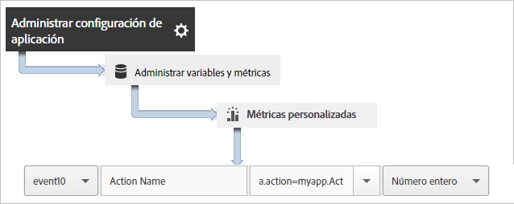
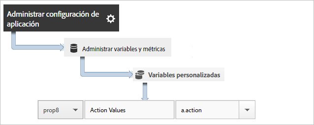
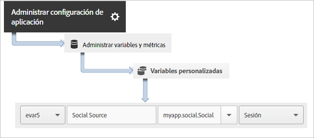

# Seguimiento de acciones de aplicaciones {#track-app-actions}

Las acciones son los eventos que tienen lugar en su aplicación de Android y que desea medir.

Cada acción tiene una o más métricas correspondientes que se incrementan cada vez que tiene lugar el evento. Por ejemplo, podría enviar una llamada a `trackAction` por cada nueva suscripción, cada vez que se vea un artículo o cada vez que se complete un nivel. El seguimiento de acciones no es automático, por lo que debe llamar a `trackAction` cuando tenga lugar un evento cuyo seguimiento desee realizar y, a continuación, asignar la acción a un evento personalizado.

## Tracking actions {#section_380DF56C4EE4432A823940E4AE4C9E91}

1. Agregue la biblioteca al proyecto e implemente el ciclo vital.

   Para obtener más información, consulte *Agregar el SDK y el archivo de configuración a su proyecto* IntelliJ IDEA o Eclipse en la implementación [principal y el ciclo vital](/help/android/getting-started/dev-qs.md).

1. Importe la biblioteca:

   ```java
   import com.adobe.mobile.*;
   ```

1. Cuando la acción de la que desea realizar un seguimiento se produzca en la aplicación, llame a `trackAction` para enviar una visita para esta acción:

   ```java
   Analytics.trackAction("myapp.ActionName", null);
   ```

1. En la interfaz de usuario de Adobe Mobile Services, seleccione su aplicación y haga clic en **[!UICONTROL Administrar configuración de la aplicación]**.
1. Haga clic en **[!UICONTROL Administrar variables y métricas]** y, después, haga clic en la pestaña **Métricas personalizadas[!UICONTROL .]**

1. Asigne el nombre de datos de contexto definido en su código, por ejemplo, `myapp.ActionName`, a un evento personalizado.

   

También puede establecer una propiedad que contenga todos los valores de acción asignando una propiedad personalizada con un nombre como **[!UICONTROL Acciones personalizadas]** y estableciendo su valor en `a.action`.



## Sending additional data {#section_3EBE813E54A24F6FB669B2478B5661F9}

Además del nombre de acción, puede enviar datos de contexto adicionales con cada llamada de seguimiento de acción:

```java
HashMap<String, Object> exampleContextData = new HashMap<String, Object>(); 
exampleContextData.put("myapp.social.SocialSource", "Twitter"); 
Analytics.trackAction("myapp.SocialShare", exampleContextData);
```

El valor de los datos de contexto debe asignarse a variables personalizadas de Adobe Mobile Services:



## Action reporting {#section_0F6A54AB7A3F42C9BB042D86A0FC4630}

| Interfaz | Informe |
|--- |--- |
| Adobe Mobile Services  | **** Informe de rutas de acción.  Vea el orden en el que ocurren las acciones en su aplicación. También puede hacer clic en **[!UICONTROL Personalizar]en cualquier informe para ver las acciones clasificadas, organizadas por tendencias o en un informe desglosado. O puede aplicar un filtro para ver acciones de un segmento específico.** |
| Informes y análisis de marketing | **[!UICONTROL Informe Evento personalizado.]**  Una vez que una acción está asignada a un evento personalizado, puede ver eventos móviles similares a todos los demás eventos de Analytics. |
| Análisis específico | **[!UICONTROL Informe Evento personalizado.]**  Una vez que una acción está asignada a un evento personalizado, puede ver eventos móviles similares a todos los demás eventos de Analytics. |

