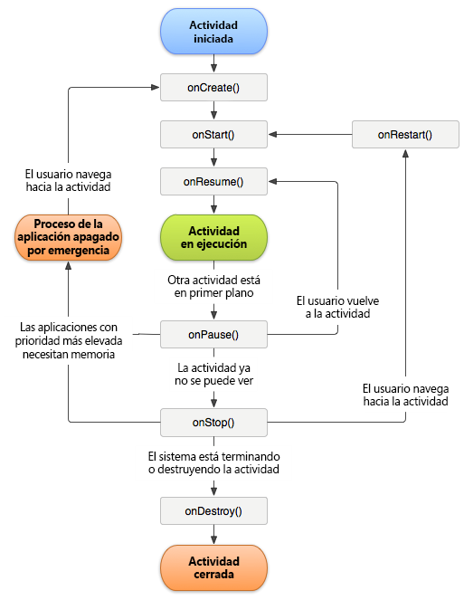

# Seguimiento de errores de aplicaciones {#track-app-crashes}

Esta información le ayuda a comprender cómo se realiza el seguimiento de bloqueos y cuáles son las prácticas recomendadas para encargarse de los falsos bloqueos.

>[!TIP]
>
>App crashes are tracked as part of lifecycle metrics. Before you can track crashes, add the library to your project and implement lifecycle. For more information, see Add the SDK and Config File to your IntelliJ IDEA or Eclipse Project in Core implementation and lifecycle.**[](/help/android/getting-started/dev-qs.md)

Cuando se implementan las métricas del ciclo vital, se llama a `Config.collectLifecycleData` en el método `OnResume` de cada actividad. In the `onPause` method, a call is made to `Config.pauseCollectingLifeCycleData`.

En `pauseCollectingLifeCycleData`, se establece un indicador para señalar una salida correcta. Cuando la aplicación se vuelve a iniciar o se reanuda, `collectLifecycleData` comprueba este indicador. Si el indicador señala que la aplicación no se cerró correctamente, se envía un dato de contexto `a.CrashEvent` junto con la siguiente llamada y se comunica un evento de bloqueo.

Para garantizar un informe de bloqueo preciso, debe llamar a `pauseCollectingLifeCycleData` dentro del método `onPause` de cada actividad. Para comprender por qué esto es básico, aquí tiene una ilustración del ciclo de duración de las actividades de Android:



Para obtener información sobre el ciclo de duración de las actividades de Android, consulte [Actividades](https://developer.android.com/guide/components/activities.html).

*Esta ilustración del ciclo vital de Android la creó y[compartió el grupo Android Open Source Project](https://source.android.com/), y se utiliza de acuerdo con los términos de la[Licencia de atribución de Creative Commons 2.5](https://creativecommons.org/licenses/by/2.5/).*

## ¿Qué puede provocar que se comunique un falso bloqueo?

1. Si está realizando una depuración con un IDE, por ejemplo, Android Studio, volver a iniciar la aplicación desde el IDE mientras la aplicación está en primer plano provocará un bloqueo.

   >[!TIP]
   >
   >You can avoid this crash by backgrounding the app before launching again from the IDE.

1. If the last foreground Activity of your app is backgrounded and does not call `Config.pauseCollectingLifecycleData();` in `onPause`, and your app is manually closed or killed by the OS, the next launch results in a crash.

## ¿Cómo se deben gestionar los fragmentos?

Los fragmentos tienen eventos de ciclo vital de aplicación similares a las actividades. Sin embargo, un fragmento no puede estar activo sin estar asociado a una actividad.

>[!IMPORTANT]
>
>Debe confiar en los eventos de ciclo vital con los que las actividades contenedoras pueden ejecutar el código. Esto lo gestionará la vista principal del fragmento.

## (Opcional) Implementar llamadas de retorno de ciclo vital de la actividad

Desde el Nivel 14 de la API, Android permite las llamadas de retorno de ciclo vital globales para las actividades. For more information, see [Application](https://developer.android.com/reference/android/app/Application).

You can use these callbacks to ensure that all of your Activities correctly call `collectLifecycleData()` and `pauseCollectingLifecycleData()`. Necesita agregar este código solo en su actividad principal y en cualquier otra actividad en que la aplicación puede iniciarse:

```js
import com.adobe.mobile.Config; 
  
public class MainActivity extends Activity { 
... 
    @Override 
    protected void onCreate(Bundle savedInstanceState) { 
        super.onCreate(savedInstanceState); 
        setContentView(R.layout.activity_main); 
  
        getApplication().registerActivityLifecycleCallbacks(new Application.ActivityLifecycleCallbacks() { 
            @Override 
            public void onActivityResumed(Activity activity) { 
                Config.setContext(activity.getApplicationContext()); 
                Config.collectLifecycleData(activity); 
            } 
  
            @Override 
            public void onActivityPaused(Activity activity) {     
                Config.pauseCollectingLifecycleData(); 
            } 
    
            // the following methods aren't needed for our lifecycle purposes, but are required to be implemented 
            // by the ActivityLifecycleCallbacks object 
            @Override 
            public void onActivityCreated(Activity activity, Bundle savedInstanceState) {} 
            @Override 
            public void onActivityStarted(Activity activity) {} 
            @Override 
            public void onActivityStopped(Activity activity) {} 
            @Override 
            public void onActivitySaveInstanceState(Activity activity, Bundle outState) {} 
            @Override 
            public void onActivityDestroyed(Activity activity) {} 
        }); 
    } 
... 
}
```

To send additional context data with your lifecycle call by using `Config.collectLifecycleData(Activity activity`, `Map<String`, `Object> contextData)`, you must override the `onResume` method for that Activity and ensure that you call `super.onResume()` after manually calling `collectLifecycleData`.

```js
@Override 
protected void onResume() { 
    HashMap<String, Object> cdata = new HashMap<>(); 
    cdata.put("someKey", "someValue"); 
    Config.collectLifecycleData(this, cdata); 
  
    super.onResume(); 
}
```

