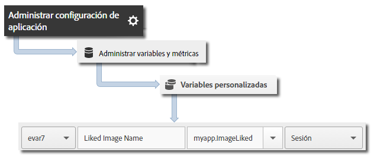

# Valor de duración de visitantes {#visitor-lifetime-value}

El valor de duración le permite medir y tomar como destino un valor de duración para cada usuario de Android. El valor puede utilizarse para almacenar compras acumuladas en el tiempo, visualizaciones de anuncios, visualizaciones de vídeo completas, usos compartidos en medios sociales, cargas de fotografías, etc.

Cada vez que envía un valor con `trackLifetimeValueIncrease`, el valor se agrega al valor existente. El valor de duración se almacena en el dispositivo y se puede recuperar en cualquier momento realizando una llamada a `lifetimeValue`.

## Seguimiento del valor de duración de visitantes {#section_390943A49AF841F2941E65D6DF2B3F5A}

1. Agregue la biblioteca al proyecto e implemente el ciclo vital.

   Para obtener más información, consulte *Agregar el SDK y el archivo de configuración a su proyecto IntelliJ IDEA o Eclipse* en [Implementación principal y ciclo de vida](/help/android/getting-started/dev-qs.md).
1. Importe la biblioteca:

   ```java
   import com.adobe.mobile.*;
   ```

1. Llame a `trackLifetimeValueIncrease` con la cantidad en que aumenta el valor:

   ```java
   Analytics.trackLifetimeValueIncrease(BigDecimal.valueOf(5.0), null);
   ```

## Envío de datos adicionales {#section_3EBE813E54A24F6FB669B2478B5661F9}

Además del valor de duración, puede enviar datos de contexto adicionales con cada llamada de seguimiento de acción:

```java
HashMap cdata = new HashMap<String, Object>(); 
cdata.put("myapp.ImageLiked", imageName); 
Analytics.trackLifetimeValueIncrease(BigDecimal.valueOf(5.0), cdata);
```

El valor de los datos de contexto debe asignarse a variables personalizadas de Adobe Mobile Services:


