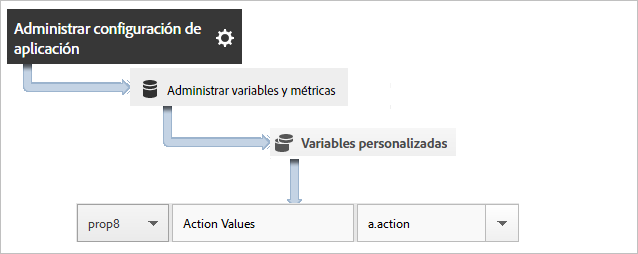

# Seguimiento de acciones de aplicaciones {#track-app-actions}

Las acciones son los eventos que tienen lugar en su aplicación y que desea medir. Cada acción tiene una o más métricas correspondientes que se incrementan cada vez que tiene lugar el evento. Por ejemplo, puede realizar un seguimiento de cuándo se realiza una nueva suscripción, cuándo se ve un artículo o cuándo se completa un nivel. Las métricas correspondientes a estos eventos se configuran como suscripciones, artículos leídos y niveles completados.

No se realiza un seguimiento automático de las acciones y, por lo tanto, para realizar un seguimiento de un evento, debe llamar a `trackAction`.

## Tracking actions {#section_380DF56C4EE4432A823940E4AE4C9E91}

1. Agregue la biblioteca al proyecto e implemente el ciclo vital.

   Para obtener más información, consulte *Agregar el SDK y el archivo de configuración al proyecto* en [Implementación principal y Ciclo vital](/help/ios/getting-started/dev-qs.md).
1. Importe la biblioteca.

   ```objective-c
   #import "ADBMobile.h"
   ```

1. Cuando la acción de la que desea realizar un seguimiento se produzca en la aplicación, llame a `trackAction` para enviar una visita para esta acción.

   ```objective-c
   [ADBMobile trackAction:@"myapp.ActionName"  
                     data:nil];
   ```

   >[!TIP]
   >
   >If the code where you are adding this call might run while the app is in the background, call `trackActionFromBackground` instead of `trackAction`.

1. In the Adobe Mobile services UI, select your app and click **[!UICONTROL Manage App Settings]**.

1. Haga clic en **[!UICONTROL Administrar variables y métricas]** y, después, haga clic en la pestaña **Métricas personalizadas[!UICONTROL .]**

1. Asigne el nombre de datos de contexto definido en su código, por ejemplo, `a.action=myapp.ActionName`, a un evento personalizado.

   

También puede establecer una propiedad que contenga todos los valores de acción asignando una propiedad personalizada con un nombre como **[!UICONTROL Acciones personalizadas]** y estableciendo su valor en `a.action`.



## Sending additional data {#section_3EBE813E54A24F6FB669B2478B5661F9}

Además del nombre de acción, puede enviar datos de contexto adicionales con cada llamada de seguimiento de acción:

```objective-c
NSMutableDictionary *contextData = [NSMutableDictionary dictionary]; 
[contextData setObject:@"Twitter" forKey:@"myapp.social.SocialSource"]; 
[ADBMobile trackAction:@"myapp.SocialShare" data:contextData];
```

Los valores de datos de contexto deben asignarse a variables personalizadas:


## Tracking background actions {#section_AC13013F207D4FBAAF27E4412034251E}

Si realiza el seguimiento de una acción cuyo código podría estar ejecutándose mientras la aplicación se encuentra en segundo plano, utilice `trackActionFromBackground` en lugar de `trackAction`. Aunque `trackActionFromBackground` contiene lógica adicional para impedir que las llamadas al ciclo vital se activen cuando no deben, los parámetros son los mismos.

## Action reporting {#section_0F6A54AB7A3F42C9BB042D86A0FC4630}

| Interfaz | Informe |
|--- |--- |
| Adobe Mobile Services  | **** Informe de rutas de acción. Vea el orden en el que ocurren las acciones en su aplicación. También puede hacer clic en **[!UICONTROL Personalizar]en cualquier informe para ver las acciones clasificadas, organizadas por tendencias o en un informe desglosado. O puede aplicar un filtro para ver acciones de un segmento específico.** |
| Informes y análisis de marketing | **[!UICONTROL Informe Evento personalizado.]**  Una vez que una acción está asignada a un evento personalizado, puede ver eventos móviles similares a todos los demás eventos de Analytics. |
| Análisis específico | **[!UICONTROL Informe Evento personalizado.]** Una vez que una acción está asignada a un evento personalizado, puede ver eventos móviles similares a todos los demás eventos de Analytics. |