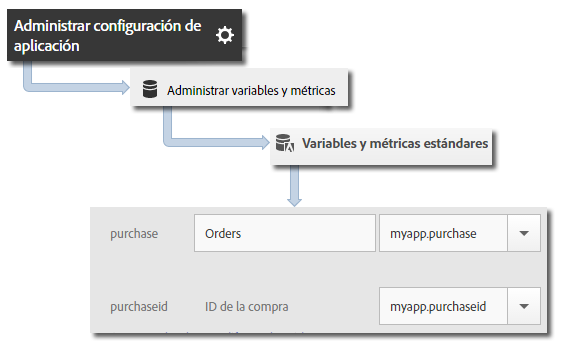

# Variable products {#products-variable}

La variable de productos no se puede establecer mediante reglas de procesamiento. En el SDK para iOS 4.x, debe utilizar una sintaxis especial en el parámetro de datos de contexto para establecer productos directamente en la llamada al servidor.

Para establecer la variable *`products`*, establezca una clave de datos de contexto en `"&&products"` y el valor empleando la sintaxis definida para la variable *`products`*:

```objective-c
[contextData setObject:@"Category;Product;Quantity;Price[,Category;Product;Quantity;Price]" forKey:@"&&products"];
```

Por ejemplo:

```objective-c
//create a context data dictionary 
NSMutableDictionary *contextData = [NSMutableDictionary dictionary]; 
 
// add products, a purchase id, a purchase context data key, and any other data you want to collect. 
// Note the special syntax for products 
[contextData setObject:@";Running Shoes;1;69.95,;Running Socks;10;29.99" forKey:@"&&products"]; 
[contextData setObject:@"1234567890" forKey:@"m.purchaseid"]; 
[contextData setObject:@"1" forKey:@"m.purchase"]; 
 
// send the tracking call - use either a trackAction or TrackState call. 
// trackAction example: 
[ADBMobile trackAction:@"purchase" data:contextData]; 
// trackState example: 
[ADBMobile trackState:@"Order Confirmation" data:contextData]; 
```

*`products`* se establece en la solicitud de imagen y las demás variables se establecen como datos de contexto. Todas las variables de datos de contexto deben asignarse mediante reglas de procesamiento:



No es necesario que asigne la variable  *`products`* empleando reglas de procesamiento, ya que el SDK la establece directamente en la solicitud de imagen.
