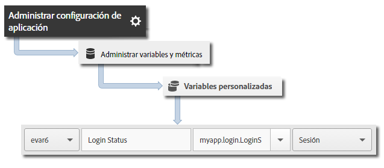

# Seguimiento de estados de aplicaciones {#track-app-states}

Los estados son las distintas pantallas o vistas de su aplicación. Cada vez que se muestra un nuevo estado en su aplicación (por ejemplo, cuando un usuario navega de la página principal al suministro de noticias), se enviará una llamada de seguimiento de estados. En iOS, el seguimiento de un estado suele realizarse en el método viewDidLoad de cada vista.

>[!TIP]
>
>Para realizar el seguimiento de estados, realice una llamada a `trackState`. El seguimiento de estados no se realiza de forma automática.

## Seguimiento de estados {#section_380DF56C4EE4432A823940E4AE4C9E91}

1. Agregue la biblioteca al proyecto e implemente el ciclo vital.

   Para obtener más información, consulte *Agregar el SDK y el archivo de configuración a su proyecto* en [Implementación principal y ciclo de vida](/help/ios/getting-started/dev-qs.md).
1. Importe la biblioteca.

   ```objective-c
   #import "ADBMobile.h"
   ```

1. Realice una llamada a la función `trackState` para enviar una visita para esta vista de estado.

   ```objective-c
   [ADBMobile trackState:@"Login Screen"  
                    data:nil];
   ```

En Adobe Mobile Services, el **[!UICONTROL State Name]** se comunica en la variable *`View State`* y se registra una visualización por cada llamada a `trackState`. En otras interfaces de Analytics, **[!UICONTROL Ver estado]** aparece como **[!UICONTROL Nombre de página]** y vistas de estado aparece como vistas de página.

## Envío de datos adicionales {#section_CFDB4F944496401786A145C209AB387C}

Además del **[!UICONTROL Nombre de estado]**, puede enviar datos de contexto adicionales con cada llamada de seguimiento de acción:

```objective-c
NSMutableDictionary *contextData = [NSMutableDictionary dictionary]; 
[contextData setObject:@"logged in" forKey:@"myapp.login.LoginStatus"]; 
[ADBMobile trackState:@"Home Screen" data:contextData];
```

El valor de los datos de contexto debe asignarse a variables personalizadas:



## Realización de informes de estado de la aplicación {#section_0F6A54AB7A3F42C9BB042D86A0FC4630}

Los estados suelen verse mediante un informe de rutas, y así se puede ver cuántos usuarios navegan por la aplicación y qué estados se ven con mayor frecuencia.

|  |  |
|--- |--- |
| Adobe Mobile Services | El informe **[!UICONTROL Ver estados]**. Este informe se basa en las rutas que los usuarios tomaron a través de su aplicación. Un ejemplo de ruta es **[!UICONTROL Inicio]** > **[!UICONTROL Configuración]** > **[!UICONTROL Fuente]**. |
| Adobe Analytics | Los estados pueden verse desde cualquier parte donde puedan verse las Páginas, como los informes **[!UICONTROL Páginas]**, **[!UICONTROL Vistas de la página]** y **[!UICONTROL Ruta]**. |
| Análisis específico | Los estados pueden verse desde cualquier parte donde puedan verse las Páginas empleando la dimensión **[!UICONTROL Página]**, la métrica **[!UICONTROL Vistas de la página]** y los informes **[!UICONTROL Ruta]**. |
