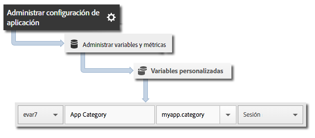

# Implementación principal y ciclo vital {#core-implementation-and-lifecycle}

Esta información le ayuda a implementar la biblioteca iOS y a recopilar métricas del ciclo vital como lanzamientos, actualizaciones, sesiones, usuarios comprometidos, etcétera.

## Descargar el SDK {#section_99FE1A17A36D4A2C943939023CF6265C}

>[!IMPORTANT]
>
>Para descargar los SDK, **debe** utilizar iOS 6 o posterior.

**Requisitos previos**

Antes de descargar el SDK, complete los pasos en *Crear un grupo de informes* en [Implementación principal y ciclo vital](/help/ios/getting-started/requirements.md) para configurar un grupo de informes de desarrollo y descargar una versión previamente rellenada del archivo de configuración.

Para descargar el SDK:

1. Descargue y descomprima el archivo `[Your_App_Name_]AdobeMobileLibrary-4.*-iOS.zip` y compruebe que dispone de los siguientes componentes de software:

   * `ADBMobile.h`, el archivo de encabezado Objective-C empleado para llamadas iOS AppMeasurement.
   * `ADBMobileConfig.json`, que es el archivo de configuración del SDK personalizado para su aplicación.
   * `AdobeMobileLibrary.a`, un binario multiarquitectura habilitado para código de bits que contiene las compilaciones de biblioteca para los simuladores (i386, x86_64) y dispositivos iOS (armv7, armv7s, arm64).

      Este binario multiarquitectura se debe vincular cuando el destino se dirija a una aplicación iOS.

   * `AdobeMobileLibrary_Extension.a`, un binario multiarquitectura habilitado para código de bits que contiene las compilaciones de biblioteca para los simuladores (i386, x86_64) y dispositivos iOS (armv7, armv7s, arm64).

      Este binario multiarquitectura se debe vincular cuando el destino se dirija a una extensión iOS.

   * `AdobeMobileLibrary_Watch.a`, un binario multiarquitectura habilitado para código de bits que contiene las compilaciones de biblioteca para los simuladores (i386, x86_64) y dispositivos Apple Watch (armv7k).

      Este binario multiarquitectura se debe vincular cuando el destino se dirija a una aplicación de extensión Apple Watch (watchOS 2).

   * `AdobeMobileLibrary_TV.a`, un binario multiarquitectura habilitado para código de bits que contiene las compilaciones de biblioteca para el simulador (x86_64) y los dispositivos Apple TV (arm64) nuevos.

      Este binario multiarquitectura se debe vincular cuando el destino se dirija a una aplicación Apple TV (tvOS).

>[!IMPORTANT]
>
>Si descarga el SDK fuera de la interfaz de usuario de Adobe Mobile Services, el archivo `ADBMobileConfig.json` deberá configurarse de forma manual. Si no tiene experiencia previa con Analytics ni con el SDK de Mobile y desea configurar un grupo de informes de desarrollo y descargar una versión previamente rellenada del archivo de configuración, consulte [Antes de empezar](/help/ios/getting-started/requirements.md).

## Añadir el SDK y el archivo de configuración a su proyecto {#section_93C25D893B4A4CD3B996CF3C5590C8DC}

1. Inicie el IDE de Xcode y abra la aplicación.
1. En Navegador de proyectos, arrastre el directorio `AdobeMobileLibrary` y suéltelo debajo de su proyecto.
1. Compruebe lo siguiente:

   * La casilla de verificación **[!UICONTROL Copiar elementos si es necesario]** está seleccionada.
   * **[!UICONTROL Crear grupos]** está seleccionado.
   * Ninguna de las casillas de verificación en la sección **[!UICONTROL Agregar a destinos]** está seleccionada.

   

1. Haga clic en **[!UICONTROL Finalizar]**.
1. En el **[!UICONTROL Navegador de proyectos]**, seleccione **`ADBMobileConfig.json`**.
1. En el **[!UICONTROL Inspector de archivos]**, agregue el archivo JSON a cualquier destino de su proyecto que vaya a utilizar el SDK de Adobe.

   

1. En el **[!UICONTROL Navegador de proyectos]**, complete los pasos siguientes:

   1. Haga clic en su aplicación.
   1. En la ficha **[!UICONTROL General]**, seleccione sus destinos y vincule los marcos y bibliotecas necesarios en las secciones **[!UICONTROL Marcos vinculados]** y **[!UICONTROL bibliotecas]**.
   * **Destinos de aplicaciones iOS**
      * `SystemConfiguration.framework`
      * `WebKit.framework`
      * `libsqlite3.0.tbd`
      * `AdobeMobileLibrary.a`
      * `CoreLocation.framework` (opcional, pero necesaria para las funcionalidades de seguimiento geográfico)
   * **Extensión iOS Target**

      * `SystemConfiguration.framework`
      * `libsqlite3.0.tbd`
      * `AdobeMobileLibrary\_Extension.a`
   * **Apple Watch (watchOS 2) Target**

      * `libsqlite3.0.tbd`
      * `AdobeMobileLibrary\_Watch.a`
   * **Apple TV (tvOS) Target**

      * `SystemConfiguration.framework`
      * `libsqlite3.0.tbd`
      * `AdobeMobileLibrary\_TV.a`

   >[!CAUTION]
   >
   > Vincular más de un archivo `AdobeMobileLibrary*.a` en el mismo destino resultará en un comportamiento inesperado o en la imposibilidad de compilar.

1. Confirme que la aplicación se compila sin errores.

## Implementar métricas del ciclo vital {#section_532702562A7A43809407C9A2CBA80E1E}

>[!IMPORTANT]
>
>iOS enviará la información del ciclo de vida con o sin llamar `collectlifecycledata`; y `collectlifecycledata` es solo una forma de iniciar el ciclo de vida antes en la secuencia de lanzamiento de la aplicación.

Después de habilitar el ciclo vital, cada vez que inicie la aplicación se enviará una visita para medir inicios, actualizaciones, sesiones, usuarios comprometidos y otras [Métricas del ciclo vital](/help/ios/metrics.md).

Añada una llamada `collectLifecycleData`/`collectLifecycleDataWithAdditionalData` en `application:didFinishLaunchingWithOptions`:

```objective-c
- (BOOL)application:(UIApplication *)application didFinishLaunchingWithOptions:(NSDictionary *)launchOptions { 
 [ADBMobile collectLifecycleData]; 
    return YES; 
}
```

### Incluir datos adicionales en las llamadas al ciclo vital

Para incluir datos adicionales en las llamadas al ciclo vital, utilice `collectLifecycleDataWithAdditionalData`:

>[!IMPORTANT]
>
>Cualquier dato pasado al SDK mediante `collectLifecycleDataWithAdditionalData:` será persistente en `NSUserDefaults` por acción del SDK. El SDK elimina del parámetro `NSDictionary` los valores que no pertenezcan a los tipos `NSString` o `NSNumber`.

```objective-c
- (BOOL)application:(UIApplication *)application didFinishLaunchingWithOptions:(NSDictionary *)launchOptions { 
    NSMutableDictionary *contextData = [NSMutableDictionary dictionary]; 
    [contextData setObject:@"Game" forKey:@"myapp.category"]; 
    [ADBMobile collectLifecycleDataWithAdditionalData:contextData]; 
    return YES; 
}
```

El valor de los datos de contexto adicionales que se envían con `collectLifecycleDataWithAdditionalData` debe asignarse a variables personalizadas en Adobe Mobile Services:



Otras métricas del ciclo vital se recopilan automáticamente. Para obtener más información, consulte [Métricas del ciclo vital](/help/ios/metrics.md).

## Qué hacer a continuación {#section_A24DC703359D4B5C8F493D6421306FD3}

Complete las siguientes tareas:

* [Seguimiento de estados de aplicaciones](/help/ios/analytics-main/states.md)
* [Seguimiento de acciones de aplicaciones](/help/ios/analytics-main/actions.md)
