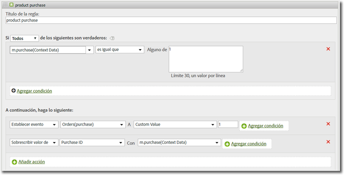

# Variable Products {#products-variable}

La variable products no se puede establecer mediante reglas de procesamiento. En el SDK móvil, debe utilizar una sintaxis especial dentro del parámetro de datos de contexto para establecer products directamente en la llamada al servidor.

To set the *`products`* variable, set a context data key to `"&&products"`, and set the value using the syntax defined for the *`products` variable:

```js
cdata["&&products"] = "Category;Product;Quantity;Price[,Category;Product;Quantity;Price]";
```

Por ejemplo:

```js
//create a context data dictionary 
var cdata = new Windows.Foundation.Collections.PropertySet(); 
 
// add products, a purchase id, a purchase context data key, and any other data you want to collect. 
// Note the special syntax for products 
cdata["&&products"] = ";Running Shoes;1;69.95,;Running Socks;10;29.99"; 
cdata["m.purchaseid"] = "1234567890"; 
cdata["m.purchase"] = "1"; 
 
var ADB = ADBMobile; 
// send the tracking call - use either a trackAction or TrackState call. 
// trackAction example: 
ADB.Analytics.trackAction("purchase", cdata); 
// trackState example: 
ADB.Analytics.trackState("Order Confirmation", cdata);
```

The *`products`* is set directly on the image request, and the other variables are set as context data. Todas las variables de datos de contexto deben asignarse mediante reglas de procesamiento:



No es necesario asignar la *`products`* variable mediante reglas de procesamiento, ya que el SDK la establece directamente en la solicitud de imagen.

## Variable products con eVars de comercialización y events (eventos) específicos de productos {#section_685D53AD3D064F9A8E225F995A9BA545}

An example of the *`products`* variable with Merchandising eVars and product-specific events.

```
//create a context data dictionary 
var cdata = new Windows.Foundation.Collections.PropertySet(); 
  
// add products, a purchase id, a purchase context data key, and any other data you want to collect. 
// Note the special syntax for products 
cdata["&&events"] = "event1 "; 
cdata["&&products"] = ";Running Shoes;1;69.95;event1=5.5;eVar1=Merchandising,;Running Socks;10;29.99"; 
cdata["m.purchaseid"] = "1234567890"; 
cdata["m.purchase"] = "1"; 
  
var ADB = ADBMobile; 
// send the tracking call - use either a trackAction or TrackState call. 
// trackAction example: 
ADB.Analytics.trackAction("purchase", cdata); 
// trackState example: 
ADB.Analytics.trackState("Order Confirmation", cdata);
```

>[!TIP]
>
>Si se activa un evento específico del producto mediante la *`&&products`* variable, también se debe establecer ese evento en la *`&&events`* variable; de lo contrario, el evento se filtrará durante el procesamiento.

