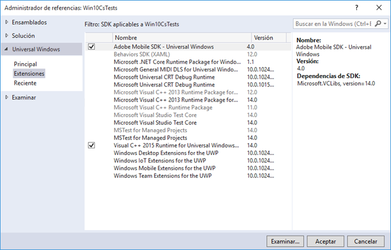

# Extensiones de Windows Visual Studio para soluciones de SDK de Experience Cloud 4.x {#windows-visual-studio-extensions-for-experience-cloud-solutions-x-sdk}

Esta extensión proporciona una forma mucho más sencilla de agregar la referencia del SDK para Windows de soluciones de Experience Cloud 4.x a su proyecto.

## Instalación de la biblioteca desde GitHub {#section_F55DB6241EF1475286C05FEAEBF996A3}

1. Descargue el SDK universal de Windows desde [GitHub](https://github.com/Adobe-Marketing-Cloud/mobile-services/releases).
1. Descomprima el archivo descargado localmente.
1. Haga doble clic en el botón **[!UICONTROL ADBMobileUniversalWindowsVSIX.vsix]** para abrir el instalador.
1. Select **[!UICONTROL Ubicación global]** e instale la biblioteca.

## Agregar referencias al proyecto {#section_00C14FE9243D4330BE1F4BB56FCF08B1}

1. Abra el proyecto de Windows 10.
1. Abra el cuadro de diálogo Administrador de referencias.

   

1. En el **[!UICONTROL Extensiones]** , busque y seleccione **[!UICONTROL SDK de Mobile de Adobe]**.
1. Haga clic en **[!UICONTROL OK]** para guardarlo.

   El SDK de Mobile de Adobe se agregará al proyecto. Si la variable **[!UICONTROL Tiempo de ejecución de Microsoft Visual C++]** aún no se ha agregado, este paquete también se agregará al proyecto.

1. En el Administrador de configuración, seleccione un tipo de plataforma y comience a probar la aplicación.
