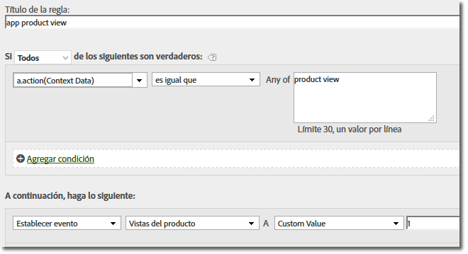

# Migrar a los SDK 4.x{#migrate-to-x}

En esta sección se describe cómo migrar de la versión 3.x del SDK móvil de Windows al SDK 4.x de la Plataforma universal de Windows para las soluciones de Experience Cloud.

With the move to version 4.x, all functionality is now accessible through static methods. You no longer need to keep track of your own objects.

Las siguientes secciones explican cómo se realiza la migración de la versión 3.x a la 4.x.

## Remove unused properties {#section_145222EAA20F4CC2977DD883FDDBBFC5}

Habrá notado que la descarga incluye un nuevo archivo `ADBMobileConfig.json`. Este archivo contiene ajustes globales y específicos de la aplicación, y reemplaza a la mayoría de las variables de configuración utilizadas en versiones anteriores.

Este es un ejemplo de archivo `ADBMobileConfig.json`:

```js
{ 
    "version" : "1.0", 
    "analytics" : { 
        "rsids" : "coolApp", 
        "server" : "my.CoolApp.com", 
        "charset" : "UTF-8", 
        "ssl" : true, 
        "offlineEnabled" : true, 
        "lifecycleTimeout" : 300, 
        "privacyDefault" : "optedin", 
        "poi" : [ 
                    ["san francisco",37.757144,-122.44812,7000], 
                    ["santa cruz",36.972935,-122.01725,600] 
                ] 
    }, 
 "target" : { 
  "clientCode" : "myTargetClientCode", 
  "timeout" : 5 
 }, 
 "audienceManager" : { 
  "server" : "myServer.demdex.com" 
 } 
}
```

Las siguientes tablas listan las variables de configuración que debe mover al archivo de configuración. Mueva el conjunto de valores para la variable en la primera columna a la variable en la segunda columna y, a continuación, elimine en su código la variable de configuración antigua.

### Migración desde 3.x

The following table provides a list of variables in the 3.x SDKs and the new name in the 4.x SDKs:

| Variable de configuración/Método | Variable in the `ADBMobileConfig.json` file. |
|--- |--- |
| offlineTrackingEnabled | "offlineEnabled" |
| reportSuiteIDs | "rsids" |
| trackingServer | "server" |
| charSet | "charset" |
| currencyCode | "currency" |
| ssl | "ssl" |
| setOfflineHitLimit | Eliminar, ya no se utiliza. |
| linkTrackVars | Eliminar, ya no se utiliza. |
| linkTrackEvents | Eliminar, ya no se utiliza. |

## Update track calls and tracking variables {#section_96E7D9B3CDAC444789503B7E7F139AB9}

En vez de utilizar las llamadas `Track` y `TrackLink`, centradas en la web, la versión 4 del SDK emplea dos métodos más apropiados para el mundo móvil:

* `TrackState` Los estados son las visualizaciones disponibles en su aplicación, como “tablero de inicio”, “configuración de la aplicación”, “carrito”, etc. Estos estados son similares a las páginas de un sitio web y las llamadas `trackState` incrementan las visualizaciones de página.

* `TrackAction` Las acciones son cosas que suceden en la aplicación y que es interesante medir, por ejemplo, “inicios de sesión”, “toques en banners”, “suscripciones a fuentes” y otras métricas. Estas llamadas no incrementan las visualizaciones de página.

El parámetro `contextData` para ambos métodos contiene pares de nombre-valor que se envían como datos de contexto.

### Events, props, eVars

Si ha observado los métodos [del](/help/universal-windows/c-configuration/methods.md)SDK, probablemente se esté preguntando dónde configurar eventos, eVars, props, herederos y listas. En la versión 4, ya no puede asignar estos tipos de variables directamente en la aplicación. Ahora el SDK utiliza datos de contexto y reglas de procesamiento para asignar los datos de su aplicación a variables de Analytics de cara a la realización de informes.

Las reglas de procesamiento ofrecen las siguientes ventajas:

* Puede cambiar la asignación de datos sin tener que enviar una actualización al App Store.
* Puede utilizar nombres significativos para los datos, en vez de establecer variables específicas para un grupo de informes.
* El impacto de enviar los datos extra es ínfimo. Estos valores no aparecen en los informes hasta que se los asigna mediante reglas de procesamiento.

Para obtener más información, consulte la sección Reglas *de* procesamiento en Información general [de Analytics](/help/universal-windows/analytics/analytics.md).

Cualquier valor que asignara directamente a variables debe agregarse a los datos de contexto. This means that calls to `SetProp`, `SetEvar`, and assignments to persistent context data should all be removed and the values added to context data.

### AppSection/Server, GeoZip, transaction ID, Campaign, and other standard variables

Cualquier otro dato que configurara en el objeto de medición, incluidas las variables arriba indicadas, deben agregarse a los datos de contexto. Es decir, los únicos datos enviados con una llamada `TrackState` o `TrackAction` son la carga útil en el `data` parámetro .

**Replace tracking calls**

En todo su código, sustituya los siguientes métodos con una llamada a `trackState` o `trackAction`:

**Migración desde 3.x:**

* TrackAppState (TrackState)
* TrackEvents (TrackAction)
* Track (TrackAction)
* TrackLinkURL (TrackAction)

## Servicio de ID personalizado {#section_2CF930C13BA64F04959846E578B608F3}

Replace the `visitorID` variable with a call to `setUserIdentifier`.

## Offline tracking {#section_5D4CD8CD1BE041A79A8657E31C0D24C6}

El seguimiento sin conexión está habilitado en el `ADBMobileConfig.json` archivo. El resto de la configuración sin conexión se realiza automáticamente.

En todo su código, elimine las llamadas a los métodos siguientes:

**Migración desde 3.x:**

* SetOnline
* SetOffline

## Products variable {#section_AFBA36F3718C44D29AF81B9E1056A1B4}

Como la variable no está disponible en las reglas de procesamiento, puede utilizar la siguiente sintaxis para establecer `products`products:

```js
// create a processing rule to set the corresponding product event. 
// for example, set the Product Views event when context data a.action = "product view" 
var cdata = new Windows.Foundation.Collections.PropertySet(); 
cdata["&&products"] = ";Cool Shoe"; 
ADB.Analytics.trackAction("product view", cdata);
```



The value of `"&&products"` (in this example, the value is `";Cool Shoe`") should follow the products string syntax for the type of event that you are tracking.
