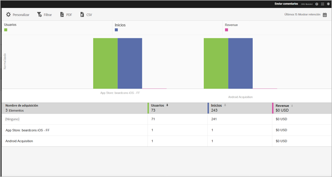

# Adquisición {#acquisition}

Los especialistas en marketing pueden crear vínculos de seguimiento para promover y llevar el tráfico a sus aplicaciones. Estos vínculos de seguimiento pueden llevar a los usuarios hasta tiendas de aplicaciones, vínculos profundos de aplicaciones e intersticiales. Esto se puede correlacionar después con el comportamiento dentro de las aplicaciones. Un especialista en mercadotecnia puede crear un vínculo para dirigir a los usuarios a iOS, Android u otras plataformas según corresponda.

## Nueva versión del SDK de Adobe Experience Cloud

¿Busca información y documentación relacionada con el SDK móvil de Adobe Experience Platform? Haga clic [aquí](https://aep-sdks.gitbook.io/docs/) para obtener la documentación más reciente.

En septiembre de 2018, publicamos una nueva versión principal del SDK. Estos nuevos SDK móviles de la Adobe Experience Platform se pueden configurar a través de [Experience Platform Launch](https://www.adobe.com/es/experience-platform/launch.html).

* Para empezar, vaya a [Launch](https://launch.adobe.com/).
* Para ver el contenido de los repositorios del SDK de la plataforma Experience, vaya a [Github: SDK de la Adobe Experience Platform](https://github.com/Adobe-Marketing-Cloud/acp-sdks).

>[!IMPORTANT]
>
> Si utiliza los SDK móviles de la Adobe Experience Platform con Adobe Launch, también **debe** instalar la extensión de Adobe Analytics Mobile Services para utilizar funciones como, por ejemplo, los enlaces de adquisición. Para obtener más información, consulte [Adobe Analytics: Mobile Services](https://aep-sdks.gitbook.io/docs/using-mobile-extensions/adobe-analytics-mobile-services). Para obtener más información sobre el uso de los vínculos de adquisición y marketing con los SDK de Experience Cloud, consulte [Vínculos de adquisición y marketing](https://aep-sdks.gitbook.io/docs/using-mobile-extensions/adobe-analytics-mobile-services#acquisition-and-marketing-links).

>[!IMPORTANT]
>
>Aunque puede configurar funciones en la interfaz de usuario, estas no funcionarán hasta que descargue el archivo de configuración generado y lo agregue al SDK. Para obtener información sobre cómo descargar y configurar los SDK, consulte la sección *Documentación sobre los SDK* en esta página.

Puede crear, editar, administrar y ver informes en vínculos de marketing de aplicaciones móviles a los que se puede realizar un seguimiento.

>[!TIP]
>
>Esta funcionalidad requiere Adobe Analytics para aplicaciones móviles o el SKU premium de Adobe Analytics.

Los siguientes informes de adquisición contienen datos sobre la eficacia de los vínculos de marketing:

* **Información general** {#section_5B2BA47F22694919A472AB591101237E}

   Este informe muestra las principales campañas que condujeron a los usuarios hasta su aplicación y contiene información sobre el rendimiento de las campañas en relación con otros metadatos de seguimiento, como el origen de adquisición, el medio, el término y el contenido.

   

* **Informe de vínculos** {#section_A23A640C363B43569D9D484CF49EA277}

   Este informe ofrece una vista clasificada sobre el rendimiento de los vínculos de marketing. Además de ver los nombres de los vínculos con métricas clave de rendimiento, este informe es completamente personalizable. Para obtener más información, consulte [Personalización de informes](/help/using/usage/reports-customize/t-reports-customize.md).

   Recuerde la información siguiente:

   * Puede hacer clic en los iconos de flecha de los encabezados de columna para ordenar los datos en orden ascendente o descendente.
   * Para exportar los datos a un documento PDF; puede hacer clic en **[!UICONTROL Descargar]**.
   
