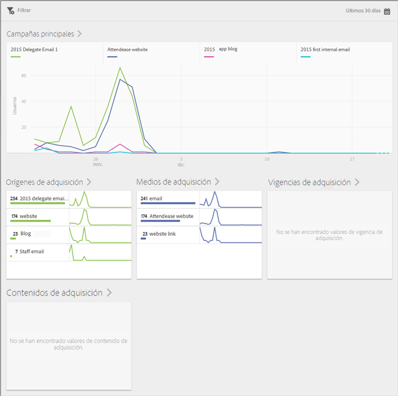

# Adquisición {#acquisition}

Los especialistas en marketing pueden crear vínculos de seguimiento para promover y llevar el tráfico a sus aplicaciones. Estos vínculos de seguimiento pueden llevar a los usuarios hasta tiendas de aplicaciones, vínculos profundos de aplicaciones e intersticiales. Esto se puede correlacionar después con el comportamiento dentro de las aplicaciones. Un especialista en marketing puede crear un vínculo que dirija a los usuarios a las plataformas iOS, Android u otras según corresponda.

## Nueva versión del SDK de Adobe Experience Cloud

¿Busca información y documentación relacionada con el SDK Mobile de la Adobe Experience Platform? Haga clic [aquí](https://aep-sdks.gitbook.io/docs/) para consultar los documentos más recientes.

En septiembre de 2018, publicamos una nueva versión principal del SDK. Estos nuevos SDK Mobile de la Adobe Experience Platform se pueden configurar a través de [Experience Platform Launch](https://www.adobe.com/experience-platform/launch.html).

* Para empezar, vaya a [Launch](https://launch.adobe.com/).
* Para ver el contenido de los repositorios del SDK de la plataforma Experience, vaya a [Github: SDK de la Adobe Experience Platform](https://github.com/Adobe-Marketing-Cloud/acp-sdks).

>[!IMPORTANT]
>
> If you are using the Adobe Experience Platform Mobile SDKs with Adobe Launch, you **must** also install the Adobe Analytics Mobile Services extension to use Adobe Mobile Services features such as Acquisition links. Para obtener más información, consulte [Adobe Analytics: Mobile Services](https://aep-sdks.gitbook.io/docs/using-mobile-extensions/adobe-analytics-mobile-services). For more information about using Acquisition and Marketing Links with the Experience Cloud SDKs, see [Acquisition and Marketing Links](https://aep-sdks.gitbook.io/docs/using-mobile-extensions/adobe-analytics-mobile-services#acquisition-and-marketing-links).

>[!IMPORTANT]
>
>Although you can configure features in the UI, these features will not work until you download the generated configuration file and add this file to the SDK. For information about downloading and configuring the SDKs, see the *SDK documentation* section on this page.)

You can create, edit, manage, and view reports on trackable mobile app Marketing Links.

>[!TIP]
>
>Esta funcionalidad requiere el SKU de Adobe Analytics - Aplicaciones móviles o Adobe Analytics Premium.

Los siguientes informes de adquisición proporcionan una visión detallada del rendimiento de los vínculos de marketing:

* **Información general** {#section_5B2BA47F22694919A472AB591101237E}

   Este informe muestra las principales campañas que condujeron a los usuarios hasta su aplicación y contiene información sobre el rendimiento de las campañas en relación con otros metadatos de seguimiento, como el origen de adquisición, el medio, el término y el contenido.

   

* **Informe de vínculos** {#section_A23A640C363B43569D9D484CF49EA277}

   Este informe proporciona una vista clasificada del rendimiento de los vínculos de marketing. Además de ver los nombres de los vínculos con métricas clave de rendimiento, este informe es completamente personalizable. Para obtener más información, consulte [Personalizar informes](/help/using/usage/reports-customize/t-reports-customize.md).

   Recuerde la información siguiente:

   * Puede hacer clic en los iconos de las flechas que hay en los encabezados de columna para disponer los datos en orden ascendente o descendente.
   * Para exportar los datos a un documento PDF; puede hacer clic en **[!UICONTROL Descargar]**.
   
