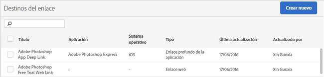

# Crear y administrar destinos de vínculo {#create-and-manage-link-destinations}

En la página Administrar destinos de vínculo, puede crear, editar, archivar/desarchivar y eliminar destinos de vínculo. Estos destinos se pueden invocar en línea cuando se crean vínculos de marketing, notificaciones push o mensajes en aplicaciones.

Para mostrar la página Administrar destinos de vínculo:

1. En el menú de navegación de la izquierda, haga clic en **[!UICONTROL Administrar aplicaciones]**.
1. Haga clic en el nombre de la aplicación para mostrar la página Información de la aplicación.
1. En el lado superior derecho, haga clic en **[!UICONTROL Administrar destinos de vínculo]**.

La página Destinos del vínculo muestra los destinos de vínculo y proporciona las opciones para crear, archivar, desarchivar, editar y eliminar destinos de vínculo.

Por ejemplo:

