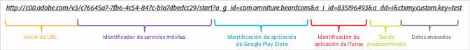

# Creación manual de vínculos de adquisición {#create-acquisition-link-manually}

Puede crear vínculos de marketing para adquirir nuevos usuarios de aplicaciones móviles sobre la marcha configurando de forma manual los parámetros de URL.

>[!IMPORTANT]
>
>Esta característica requiere la versión 4.6 o posterior del SDK. Para obtener más información, consulte [Requisitos previos de adquisición](/help/using/acquisition-main/c-acquisition-prerequisites.md).

En el siguiente diagrama se ilustran los componentes de un vínculo de seguimiento incorporado manualmente, así como los diferentes parámetros de URL que debe configurar correctamente al crear vínculos de adquisición de forma manual.

Este vínculo está configurado para hacer un redireccionamiento específico de la plataforma a Google Play Store o a Apple App Store para una aplicación móvil. Si no se puede determinar el destino, la tienda predeterminada se ha establecido en Apple App Store. Una vez que la aplicación se haya instalado, la clave de contexto personalizada `my.custom.key:test` se adjunta a la petición de instalación de Analytics.

Para crear vínculos manualmente, use el formato URL siguiente:

`http(s)://c00.adobe.com/v3/ {mobile-services-app-hash}/start? {parameters}`

>[!TIP]
>
>La versión del SDK de Android que utiliza no tiene ningún efecto sobre este proceso.

En el caso de iOS, asegúrese de usar el protocolo correcto:

* Use **HTTP** si utiliza el SDK de iOS anterior a la versión 4.7.0 o el SDK 4.7.0 de iOS o posteriores y, además, **[!UICONTROL Utilizar HTTPS]** **no** está seleccionado en la página Administrar configuración de aplicación.
* Use **HTTPS** si utiliza el SDK 4.7.0 de iOS o posteriores y, además, **[!UICONTROL Utilizar HTTPS]** **está** seleccionado en la página Administrar configuración de aplicación.

Cuando se hayan cumplido las condiciones siguientes:

* `{mobile-services-app-hash}` coincide con el identificador de la aplicación presente en el archivo de configuración `acquisition:appid `.

   Puede situar `{mobile-services-app-hash}` en la página Administrar configuración de aplicación en las opciones de SDK de adquisición del campo ID de seguimiento.

   

* `{parameters}` es una lista de parámetros de consulta de URL con nombres específicos.

Esta es la lista de parámetros:

* **`a_g_id`**

   Identificador de aplicación de Google Play Store.

   * Valor de muestra: `com.adobe.beardcons`

* **`a_g_lo`**

   Sustitución de configuración regional de Google Play Store.

   * Valor de muestra: `ko`

* **`a_i_id`**

   Identificador de aplicación de iTunes.

   * Valor de muestra: `835196493`

* **`a_i_lo`**

   Sustitución de configuración regional de iTunes.

   * Valor de muestra: `jp`

* **`a_dd`**

   Tienda predeterminada para redireccionamiento automático.

   * Valor de muestra: `i | g`

* **`a_cid`**

   Sustitución de ID personalizado (normalmente, IDFA para iOS o ADID para Android).

   * Valor de muestra: `Any String < 255 characters (UTF-8 encoded)`

* **`ctx*`**

   Las claves con el prefijo `ctx` terminarán como datos de contexto de la petición de inicio resultante.

   * Valor de muestra: `ctxmy.custom.key=myValue`

* **`ctxa.referrer.campaign.name`**

   Nombre de campaña de adquisición.

   Este parámetro es obligatorio para la generación de informes si desea comparar el rendimiento de distintos vínculos de adquisición.

   * Valor de muestra: Conferencia Cumbre 2015

* **`ctxa.referrer.campaign.trackingcode`**

   Código de seguimiento

   Este parámetro es obligatorio para la generación de informes si desea comparar el rendimiento de distintos vínculos de adquisición.

   * Valor de muestra: `lexsxouj`

* **`ctxa.referrer.campaign.source`**

   La fuente.

   * Valor de muestra: Red de publicidad

* **`ctxa.referrer.campaign.medium`**

   Medio

   * Valor de muestra: Correo electrónico

* **`ctxa.referrer.campaign.content`**

   Contenido

   * Valor de muestra: Imagen n.º 325689

* **`ctxa.referrer.campaign.term`**

   Término

   * Valor de muestra: botas+senderismo

Cuando cree vínculos de adquisición manualmente, recuerde la siguiente información:

* Los parámetros que no coinciden con los de la tabla se transfieren como parte del redireccionamiento de tiendas de aplicaciones.
* Todos los parámetros son técnicamente opcionales, aunque el vínculo no funcionará si se especifica, al menos, un ID de tienda.

   Un ejemplo de ID de tienda sería `a_g_id`/ `a_i_id`.

* Si la tienda de destino no se puede determinar automáticamente y no hay ninguna predeterminada, se devuelve el error 404.

