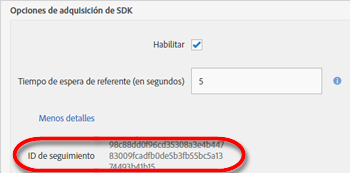

# Creación manual de vínculos de adquisición {#create-acquisition-link-manually}

Puede crear vínculos de marketing para adquirir nuevos usuarios de aplicaciones móviles sobre la marcha configurando manualmente los parámetros de URL.

>[!IMPORTANT]
>
>Esta función requiere la versión 4.6 o posterior del SDK. Para obtener más información, consulte Requisitos previos [de adquisición](/help/using/acquisition-main/c-acquisition-prerequisites.md).

El diagrama siguiente ilustra los componentes de un vínculo de seguimiento generado manualmente y muestra los diferentes parámetros de URL que debe configurar correctamente al crear vínculos de adquisición manualmente.

Este vínculo está configurado para redireccionar desde una plataforma específica al Google Play Store o al Apple App Store en una aplicación móvil. En caso de que no se pueda determinar un destino, la tienda predeterminada será el Apple App Store. Una vez que la aplicación se haya instalado, la clave de contexto personalizada `my.custom.key:test` se adjunta a la petición de instalación de Analytics.

Para crear vínculos manualmente, use el formato URL siguiente:

`http(s)://c00.adobe.com/v3/ {mobile-services-app-hash}/start? {parameters}`

>[!TIP]
>
>La versión del SDK de Android que está utilizando no tiene ningún impacto en este proceso.

En el caso de iOS, asegúrese de usar el protocolo correcto:

* Use **HTTP** if you are using the iOS SDKs before version 4.7.0, or if you are using iOS SDK 4.7.0 or later, and if **[!UICONTROL Use HTTPS]** is **not** selected on the Manage App Settings page.
* Use **HTTPS** if you are using iOS SDK 4.7.0 or later and **[!UICONTROL Use HTTPS]** **is** selected on the Manage App Settings page.

Cuando se hayan cumplido las condiciones siguientes:

* `{mobile-services-app-hash}` coincide con el identificador de la aplicación del `acquisition:appid ` archivo de configuración.

   You can locate `{mobile-services-app-hash}` in the Manage App Settings page under Acquisition SDK Options in the Tracking ID field.

   

* `{parameters}` es una lista de parámetros de consulta de URL con nombres específicos.

Esta es la lista de parámetros:

* **`a_g_id`**

   Identificador de aplicación de Google Play Store.

   * Valor de muestra: `com.adobe.beardcons`

* **`a_g_lo`**

   Sustitución de configuración regional de Google Play Store.

   * Valor de muestra: `ko`

* **`a_i_id`**

   Identificador de aplicación de iTunes.

   * Valor de muestra: `835196493`

* **`a_i_lo`**

   Sustitución de configuración regional de iTunes.

   * Valor de muestra: `jp`

* **`a_dd`**

   Tienda predeterminada para redireccionamiento automático.

   * Valor de muestra: `i | g`

* **`a_cid`**

   Sustitución de ID personalizado (normalmente, IDFA para iOS o ADID para Android).

   * Valor de muestra: `Any String < 255 characters (UTF-8 encoded)`

* **`ctx*`**

   Keys prefixed with `ctx` will be in the context data of the resulting launch hit.

   * Valor de muestra: `ctxmy.custom.key=myValue`

* **`ctxa.referrer.campaign.name`**

   Nombre de campaña de adquisición.

   Este parámetro es obligatorio para la generación de informes si desea comparar el rendimiento de distintos vínculos de adquisición.

   * Valor de muestra: Conferencia Cumbre 2015

* **`ctxa.referrer.campaign.trackingcode`**

   Código de seguimiento

   Este parámetro es obligatorio para la generación de informes si desea comparar el rendimiento de distintos vínculos de adquisición.

   * Valor de muestra: `lexsxouj`

* **`ctxa.referrer.campaign.source`**

   La fuente.

   * Sample value: Ad Network

* **`ctxa.referrer.campaign.medium`**

   Medio

   * Sample value: Email

* **`ctxa.referrer.campaign.content`**

   Contenido

   * Sample value: Image # 325689

* **`ctxa.referrer.campaign.term`**

   Término

   * Sample value: hiking+boots

When you manually create acquisition links, remember the following information:

* Los parámetros que no coinciden con los de la tabla se transfieren como parte del redireccionamiento de tiendas de aplicaciones.
* Todos los parámetros son técnicamente opcionales, aunque el vínculo no funcionará, si se especifica al menos un ID de tienda.

   An example of a store ID is `a_g_id`/ `a_i_id`.

* Si la tienda de destino no se puede determinar automáticamente y no hay ninguna predeterminada, se devuelve el error 404.

