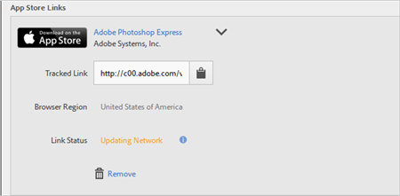

# Creación de un vínculo de adquisición{#create-an-acquisition-link}

Puede crear vínculos de tienda de aplicaciones para descargar aplicaciones directamente desde el Apple App Store y Google Play. Los vínculos que crea le permiten atribuir sus eventos de éxito a las descargas.

1. Click **[!UICONTROL Acquisition]** &gt; **[!UICONTROL Manage Acquisition Links]** &gt; **[!UICONTROL Create New]**.
1. Type the following information in the **[!UICONTROL Link Information]** section:

   * (**Required**) **[!UICONTROL Name]**
Specify a descriptive name for the App Link.
   * **[!UICONTROL Código
de seguimiento]** Especifique el código de seguimiento deseado o haga clic **[!UICONTROL en Generar]** para crear un nuevo código de seguimiento.
   * **(Requerido**) **[!UICONTROL Especifique el]**
referente original, como "boletín" o "página principal".
   * **[!UICONTROL Medio]**
Especifique el medio de mercadotecnia, como «banner» o «correo electrónico».
   * **[!UICONTROL Contenido]**
Especifique el nombre o ID del anuncio con el vínculo.
   * **[!UICONTROL Término]**
Especifique los términos de pago u otros términos de búsqueda de la publicidad.
   >[!IMPORTANT]
   >
   >Los valores de los campos anteriores no se pueden cambiar una vez creado el vínculo de adquisición.

1. Type information in the fields in the **[!UICONTROL Add App Store Link]** section.

   * **[!UICONTROL Tienda de aplicaciones]**

      Seleccione una tienda de aplicaciones:
      * App Store de Apple
      * Google Play
      Las opciones de cada almacén de aplicaciones pueden variar, tal y como se describe a continuación.

   * **[!UICONTROL Región del explorador (solo App Store de Apple)]**

      Especifique un almacén de aplicaciones regional concreta para los exploradores de escritorio.

      Esta configuración permite definir el almacén de aplicaciones específica de su región a la que quiere que los vínculos de adquisición se redireccionen cuando un usuario hace clic en el vínculo del explorador de escritorio. Redireccionamiento automático de dispositivos móviles en función de la configuración de los dispositivos.

   * **[!UICONTROL Idioma del explorador (Google Play solamente))]**

      Seleccione un idioma en la lista desplegable.

      Esta configuración le permite definir un idioma específico para la visualización de Google Play en exploradores de escritorio. Los dispositivos móviles muestran el idioma en función de su propia configuración.

   * **[!UICONTROL Buscar por nombre]**

      * En el caso de Apple App Store, si no conoce el ID de la aplicación, puede buscar la aplicación por su nombre.

         Puede limitar la búsqueda mediante la selección de una región opcional en la lista desplegable **[!UICONTROL En la región].**

      * En Google Play, si no conoce el nombre del paquete, puede buscar el nombre de la aplicación por su nombre.
   * **[!UICONTROL ID de la aplicación (solo App Store de Apple)]**

      Si ha buscado la aplicación, este campo se rellena automáticamente. Puede escribir el valor del ID de aplicación directamente en lugar de buscar la aplicación.

   * **[!UICONTROL Nombre del paquete (solo Google Play)]**

      Si ha buscado la aplicación, este campo se rellena automáticamente. En lugar de buscar. también puede escribir directamente el valor Nombre del paquete.

1. To save your configuration and to generate the link, click **[!UICONTROL Add]** &gt; **[!UICONTROL Save]**.

   El vínculo recién creado aparece en la sección **[!UICONTROL Vínculos a App Store].**

   

1. Click  to copy the tracked link to your clipboard.

1. Pegue el vínculo en las publicaciones de medios sociales, publicidades, mensajes de correo electrónico, etc.