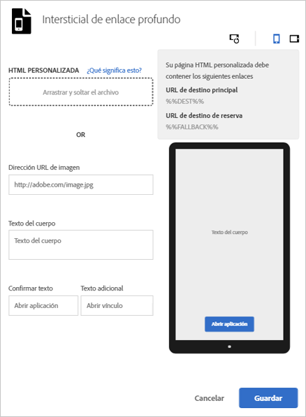

# Intersticiales {#interstitials}

Puede dirigir a los usuarios a un destino dependiendo de si tienen la aplicación instalada (un vínculo profundo de la aplicación) o no instalada (a un sitio web o una tienda de aplicaciones). Es mejor dejar la opción de enrutamiento a los usuarios. Los especialistas en marketing pueden proporcionar opciones de usuario configurando una página intersticial que muestre a los usuarios los destinos de aterrizaje disponibles.

Para configurar un intersticial al  crear un vínculo de marketing:

1. Haga clic en **[!UICONTROL Editar intersticial de vínculo profundo]**.

   

1. Rellene los campos siguientes:

   * **[!UICONTROL HTML personalizada]**

      Seleccione su página HTML intersticial personalizada.

      Mediante intersticiales personalizados, los especialistas en marketing pueden personalizar las páginas de aterrizaje intersticiales con HTML/CSS/JS personalizados, lo que les permite cambiar las páginas según requieran.

      Estos son los requisitos para la página HTML:

      * Debe ser un archivo HTML.
      * Tiene que contener los marcadores de posición `%%DEST%%` y `%%FALLBACK%%`.
      * El HTML cargado se suministra en un `<iframe>`.

         Debe asegurarse de que los objetivos del vínculo apunten a una ventana principal. Puede incluir `<base target="_parent" />` en `<head>` o especificar una propiedad de destino por cada `<a/>` individualmente.

         >[!TIP]
         >
         >Si carga HTML personalizado, las otras cuatro opciones de esta tabla solo se usan cuando elimina el archivo cargado.
   * **[!UICONTROL Dirección URL de imagen]**

      Especifique la URL para un recurso de imagen.

   * **[!UICONTROL Texto del cuerpo]**

      Especifique el texto del cuerpo para el intersticial.

   * **[!UICONTROL Confirmar texto]**

      Especifique el texto para el botón de texto.

   * **[!UICONTROL Texto adicional]**

      Especifique el texto de reserva que se va a mostrar.

      Este campo actualiza el botón de texto si falla un vínculo profundo. Los usuarios son dirigidos a probar el vínculo profundo antes de permitirles ir a otra opción. Por ejemplo, una alternativa podría ser una tienda de aplicaciones para descargar e instalar la aplicación o llevar a los usuarios al sitio web de la compañía. El texto de reserva permite a los usuarios saber que hay otra opción disponible si falla el vínculo profundo.

1. (**Opcional**) Haga clic en los iconos que aparecen sobre la imagen para ver el aspecto del intersticial rotado y en otros dispositivos.

   Puede cambiar o editar la imagen fuera de Mobile Services para asegurarse de que la imagen se muestra correctamente en distintas situaciones.
1. Haga clic en **[!UICONTROL Guardar]**.
