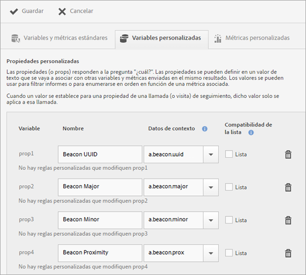
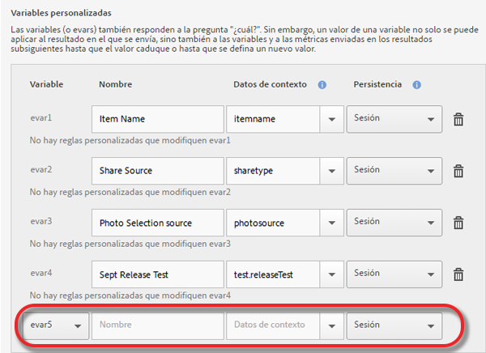

# Gestionar su aplicación {#managing-your-app}

Puede hacer un seguimiento de los datos que recibe de la aplicación y gestionarlos configurando diversas variables y métricas.

## Gestionar variables y métricas {#section_EC2D58AC334F4ED49E764B81C2423A62}

* **Variables y métricas estándar**

   Cada aplicación incluye variables y métricas para hacer un seguimiento del carro de la compra y de las actividades de compra. Parte de la información de las compras no se puede controlar con las reglas de procesamiento, por lo que el SDK expone los datos de contexto especiales de `"&&products"` Por ejemplo, puede tener las variables de adiciones al carro de la compra, eliminaciones de este, cierres de compras, pedidos, etc. Los datos de contexto se deben asignar a los datos de Adobe Analytics. Si esta variable se rellena con una asignación simple de datos de contexto, esta es la clave que se asigna. Déjela vacía si unas reglas más complejas rellenan la variable en las Herramientas de administración de Analytics.

   Para obtener más información sobre estas variables y métricas, consulte los siguientes temas:

   * [Variables de producto en Android](/help/android/analytics-main/products/products.md)
   * [Variables de producto en iOS](/help/ios/analytics-main/products/products.md)

* **Variables personalizadas**

   La página Variables personalizadas muestra todas las variables de Analytics personalizadas configuradas para el grupo de informes que contiene los datos de su aplicación. En esta página puede habilitar otras variables y asignar datos de contexto directamente a las variables de Analytics.

### Asignar datos de contexto a las variables de Analytics

Haga clic en **[!UICONTROL Administrar configuración de aplicación]** &gt; **[!UICONTROL Administrar variables y métricas]** &gt; **[!UICONTROL Variables personalizadas]**.

Estas asignaciones llaman a la misma API que se usa en las [reglas de procesamiento](https://docs.adobe.com/content/help/es-ES/analytics/admin/admin-tools/processing-rules/processing-rules.html).

Esta lista recoge las variables personalizadas que se pueden configurar:

* Las **[!UICONTROL Propiedades personalizadas]** (o props) responden a la pregunta “¿cuál?”. Las propiedades se pueden definir en un valor de texto que se vaya a asociar con otras variables y métricas enviadas en el mismo resultado. Los valores se pueden usar para filtrar informes o para enumerarse en orden en función de una métrica asociada.

   Cuando un valor se establece para una propiedad en una llamada (o visita) de seguimiento, dicho valor solo se aplica a esta llamada.

* Las **[!UICONTROL Variables personalizadas]** (o evars) también responden a la pregunta “¿cuál?”. Sin embargo, un valor de una variable no solo se puede aplicar a la visita en la que se envía, sino también a las variables y a las métricas enviadas en los resultados subsiguientes hasta que el valor caduque o hasta que se defina un nuevo valor.
* Las **[!UICONTROL Variables de lista personalizadas (o variables de valores múltiples)]** se comportan de la misma forma que las variables a excepción de que le permiten capturar varios valores en una visita. Para obtener más información, consulte [Variables de lista](https://docs.adobe.com/content/help/es-ES/analytics/implementation/javascript-implementation/variables-analytics-reporting/page-variables.html).

Las asignaciones se muestran en Analytics como si se hubieran creado en Mobile Services.

* **[!UICONTROL Nombre]**

   Nombre descriptivo de la variable de colección de datos.

* **[!UICONTROL Datos de contexto]**

   Si esta variable se rellena con una asignación simple de datos de contexto, esta es la clave que se asigna. Deje este campo vacío si más reglas complejas rellenan la variable en las Herramientas de administración de Analytics.

   Haga clic en la columna de datos de contexto y seleccione la variable de datos de contexto que desea asignar. La lista desplegable contiene las variables recibidas durante los últimos 30 días, por lo que si los datos de contexto que desea asignar no están en la lista, los puede escribir.

* **[!UICONTROL Persistencia (variables personalizadas y variables de lista personalizadas)]**

   La persistencia determina el punto en el que el valor de una variable personalizada (eVar) caducará o dejará de estar asociado a visitas adicionales. Si una eVar ha caducado cuando se activa una visita, se asociará el valor Ninguno a esa visita para esa eVar. Esto significa que no había ningún valor de eVar activo cuando se activó la visita.

   Puede seleccionar cualquiera de estas opciones:

   * **[!UICONTROL Sesión]**

      El valor de eVar persiste durante toda la visita de Analytics.

   * **[!UICONTROL Llamada de seguimiento]**

      El valor de eVar solo persiste durante la llamada de seguimiento o la visita en las que se incluyó.

   * **[!UICONTROL No caducar nunca]**

      El valor de eVar persiste en todas las llamadas de seguimiento subsiguientes.
   * **[!UICONTROL Avanzadas]**

      Adobe Analytics tiene una interfaz de usuario más avanzada para establecer la persistencia de las eVars. Si para la eVar se establece un valor de persistencia que no se admite en Mobile Services, este valor se muestra en la interfaz de usuario de Mobile Services.

      Para gestionar las eVars, haga clic en **[!UICONTROL Administrador del grupo de informes de Adobe Analytics**] &gt; **[!UICONTROL Interfaz de usuario de variables de conversión]**.

   * **[!UICONTROL Compatibilidad de lista]**

      Permite asociar varios valores que se pasan con la propiedad en una única llamada de seguimiento. El delimitador debe ser un carácter único y no puede ser cero o un espacio.

   * **[!UICONTROL Delimitador]**

      El delimitador debe ser un carácter único y no puede ser cero o un espacio.

### Variables adicionales de Analytics

Puede activar variables adicionales en la lista desplegable que hay en la parte inferior de cada sección de variables.

Seleccione un número de variable que no esté en uso y escriba un nombre. También puede proporcionar la variable de datos de contexto que desea almacenar, así como cualquier información adicional.

* **Métricas personalizadas**

   Las métricas (o los eventos) responden a las preguntas *¿cuánto?* o *¿cuántos?*. Los eventos pueden, bien aumentar cada vez que un usuario realiza una acción, o bien retener valores numéricos, como un precio. Las métricas personalizadas incluyen eventos como la creación de una aplicación, la descarga o exportación de un archivo PDF o CSV, el guardado de una campaña, la descarga de un SDK, la ejecución de un informe, la adición de un vínculo a la tienda de aplicaciones, la activación de un mensaje en la aplicación, etc.

   Seleccione uno de los siguientes tipos de métricas personalizadas:

   * **[!UICONTROL Número entero]**
   * **[!UICONTROL Número decimal]**
   * **[!UICONTROL Moneda]**

## Administrar puntos de interés {#section_990EF15E4E3B42CC807FCD9BEC8DB4C6}

Los puntos de interés permiten definir ubicaciones geográficas que puede utilizar para fines de correlación o para dirigir los mensajes en la aplicación, entre otras opciones. Al enviar una visita en un punto de interés, este se adjunta a la visita. Para obtener más información sobre los puntos de interés, consulte [Administrar puntos de interés](/help/using/location/t-manage-points.md).

## Administrar destinos de vínculo {#section_F722A387E22A430187B063D358A87711}

Puede crear, editar, archivar/desarchivar y eliminar destinos de vínculos. Estos destinos se pueden invocar en línea cuando se crean vínculos de marketing, notificaciones push o mensajes en aplicaciones. Para obtener más información sobre los destinos de vínculo, consulte [Administrar destinos de vínculo](/help/using/acquisition-main/c-manage-link-destinations/t-archive-unarchive-link-destinations.md).

## Administrar postbacks {#section_78B0A8D7AE6940E78D85AE3AB829E860}

Los postbacks permiten enviar datos recopilados por Adobe Mobile a un servidor independiente de terceros. Con los mismos activadores y las mismas características que se emplean para mostrar un mensaje en la aplicación, es posible configurar Mobile para que envíe datos personalizados a un destino de terceros. Para obtener más información sobre los postbacks, consulte [Configurar los postbacks](/help/using/c-manage-app-settings/c-mob-confg-app/signals.md).
