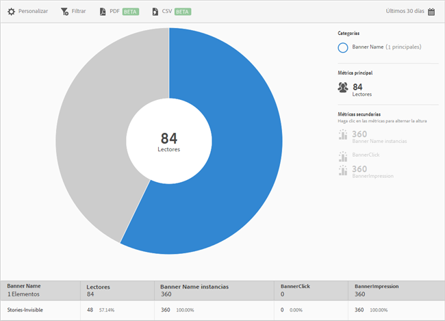

# Métricas de banner {#banner-metrics}

El informe **[!UICONTROL Métricas de banner]** proporciona una visualización radial de los datos existentes. Este informe está disponible solo para los clientes de Digital Publishing Suite (DPS).

De forma predeterminada, este informe muestra las métricas siguientes:

* **[!UICONTROL Banner Name]**, que es el nombre del banner.
* **[!UICONTROL Lectores]**, que es el número de usuarios de la aplicación.
* **[!UICONTROL Instancias de Banner Name]**, que es el número de veces que se hace referencia al banner en clics e impresiones.
* **[!UICONTROL Clic en el banner]**, que es el número de veces que los usuarios han hecho clic en el banner.
* **[!UICONTROL Banner Impression]**, que es el número de veces que se ha visto el banner (o que era visible) en una página del explorador.

Este informe es similar al informe **[!UICONTROL Tecnología]**. Para obtener información sobre cómo navegar y utilizar los informes radiales; agregar desgloses y métricas; crear actividades de Target; crear filtros adhesivos y compartir informes, consulte [Tecnología](/help/using/usage/reports-technology.md). La información incluida en este tema se puede utilizar para personalizar el informe **[!UICONTROL Métricas de banner]**.
