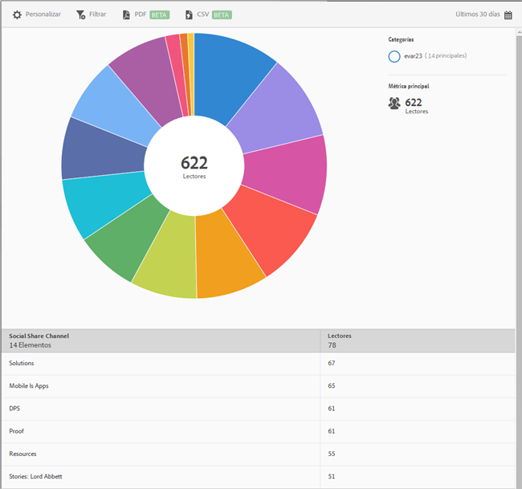

# Uso compartido en medios sociales {#social-sharing}

El informe **[!UICONTROL Uso compartido en medios sociales]** proporciona una visualización radial de los datos existentes. Este informe solo está disponible para los clientes de DPS.

De forma predeterminada, este informe muestra el número de lectores que han compartido artículos en distintos canales, como correo electrónico, mensaje, etc.

Este informe es similar al informe **[!UICONTROL Tecnología]**. Para obtener información sobre cómo navegar y utilizar los informes radiales; agregar desgloses y métricas; crear actividades de Target; crear filtros adhesivos y compartir informes, consulte [Tecnología](//help/using/usage/reports-technology.md). La información incluida en el tema Tecnología se puede utilizar para personalizar el informe **[!UICONTROL Uso compartido en medios sociales]**.
