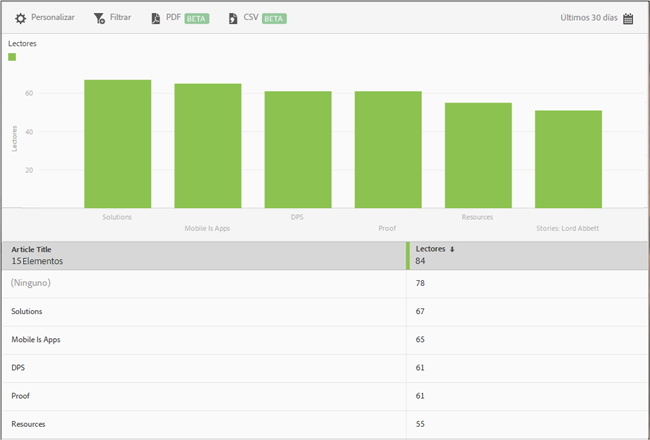

# Informe Principales 50 artículos{#top-articles}

El informe **[!UICONTROL Principales 50 artículos]** muestra un gráfico de barras y un informe de clasificación que indica los artículos más leídos y mostrados mediante el uso de la aplicación. Este informe solo está disponible para los clientes de DPS.

Aunque el informe predeterminado muestra los datos de los últimos 30 días por número de lectores, puede personalizar el informe.

De forma predeterminada, este informe muestra el título del artículo y el número de lectores.

Para este informe, puede configurar las siguientes opciones:

* **[!UICONTROL Período de tiempo]** Haga clic en el icono de **[!UICONTROL Calendario]** para seleccionar un período de tiempo personalizado o elegir un período de tiempo preestablecido en la lista desplegable.

* **[!UICONTROL Personalizar]**

   Personalice los informes cambiando las opciones **[!UICONTROL Mostrar por]**, agregando métricas, filtros, series (métricas) adicionales y mucho más. Para obtener más información, consulte [Personalización de informes](/help/using/usage/reports-customize/reports-customize.md).

* **[!UICONTROL Filtro]**

   Haga clic en **[!UICONTROL Filtro]** para crear un filtro que incluya distintos informes con el fin de ver el comportamiento de un segmento en todos los informes móviles. Un filtro adhesivo permite definir un filtro que se aplica a todos los informes sin rutas. Para obtener más información, consulte [Añadir un filtro adhesivo](/help/using/usage/reports-customize/t-sticky-filter.md).

* **[!UICONTROL Descargar]**

   Haga clic en **[!UICONTROL PDF]** o **[!UICONTROL CSV]** para descargar o abrir documentos, compartirlos con otros usuarios que no tengan acceso a Mobile Services o usarlos en presentaciones.