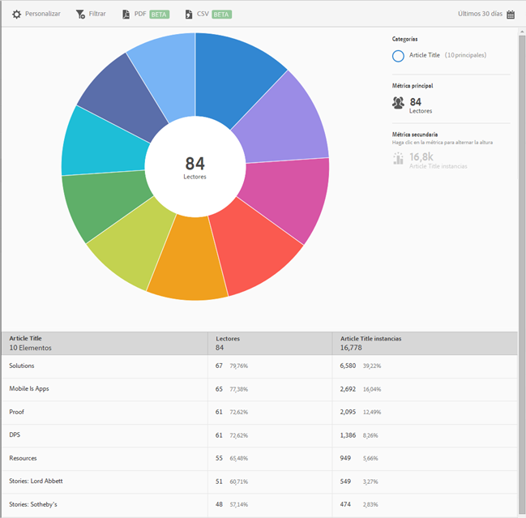

# Informe Principales 10 artículos{#top-articles}

The **[!UICONTROL Top 10 Articles]** report displays a sunburst visualization for your data. Este informe solo está disponible para los clientes de DPS.

De forma predeterminada, este informe muestra el título del artículo, el número de lectores y el porcentaje del total de lectores, así como las instancias del Article Title y el porcentaje.

Este informe es similar al informe **[!UICONTROL Tecnología].** For information about how to navigate and use sunburst reports, add breakdowns and metrics, create target activities, create sticky filters, and share reports, see [Technology](/help/using/usage/reports-technology.md). Esta información puede utilizarse para personalizar el **[!UICONTROL informe Principales 10 artículos]** .
