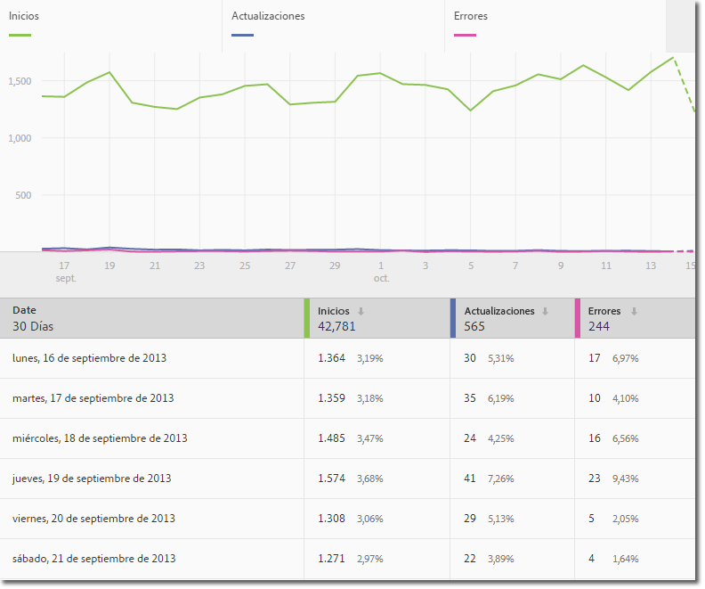
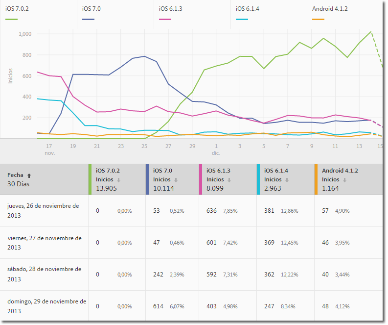
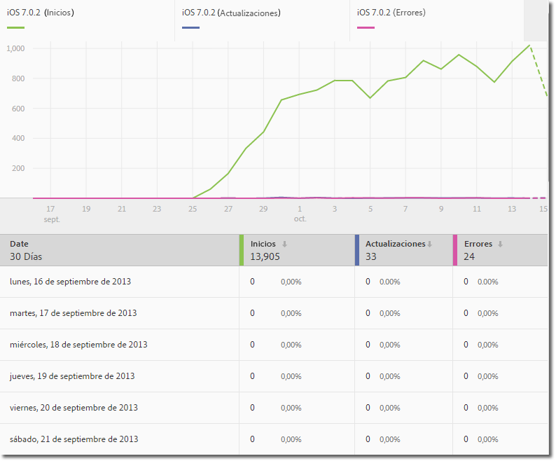
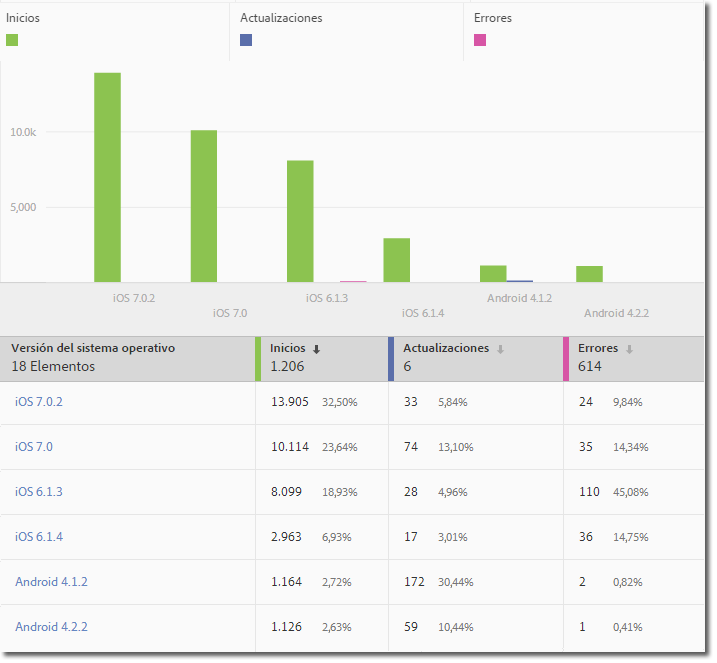
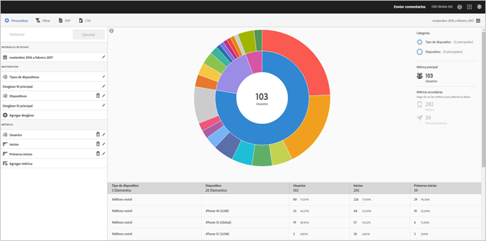
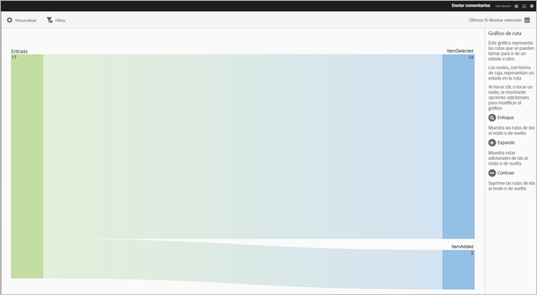
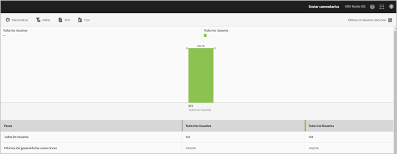

# Tipos de informes {#report-types}

{#eol}

Al personalizar informes, la gran flexibilidad puede suscitar algunas preguntas referentes a cuál es el mejor tipo de informe para obtener los datos que necesita.

Antes de personalizar los informes, debe comprender la diferencia entre una métrica y una dimensión.

* Métrica

   Una métrica se usa para medir sus datos. Las métricas son valores que se pueden contar y agregar y que se utilizan para ver la frecuencia con la que se producen acciones específicas en la aplicación. Entre las métricas comunes se incluyen: instalaciones, lanzamientos, ingresos, valores de duración e inicios de sesión. Por ejemplo, cada vez que se inicia su aplicación,  el valor de los  _launches_value aumenta una unidad.

* Dimensión

   Una dimensión se usa para describir sus datos. Las dimensiones se representan con una cadena o un número que actúa como tal (por ejemplo, un código postal), y se usan para organizar y segmentar los datos. Algunos ejemplos de dimensiones comunes son la versión del sistema operativo, el nombre de la campaña, el nombre del producto y el operador de telefonía móvil. Cada dimensión tiene un número de valores específicos asociados a ella. Por ejemplo, la dimensión Versión de SO tiene valores del tipo _iOS 7_ y _Android 4.1.2_.

Estos son los tipos de informes que se pueden generar en la interfaz de usuario de Mobile:

## Informe de horas extras {#section_2741DA54C90C49AFB17C7B9BC7AD627D}

Los informes de horas extras muestran el rendimiento de las métricas a lo largo de un periodo para que pueda identificar rápidamente los picos y las tendencias. El análisis a menudo comienza en un informe de horas extras y se mueve a los informes de clasificación y tendencias a medida que explora para investigar los factores que pueden estar contribuyendo a un pico o una tendencia de métrica.

Por ejemplo: si ve un pico en los inicios, puede ejecutar un informe de tendencias que muestre los inicios de los 5 sistemas operativos principales para ver qué sistemas operativos contribuyen más al pico en los lanzamientos:

Para ver valores de dimensión con otras métricas en un informe de horas extras, puede utilizar la métrica de instancias y definir un filtro de dimensión.

## Informe de tendencias  {#section_C9BE9A2EDBFF4D938B9AF14C8AA67883}

Los informes de tendencias ayudan a ver el rendimiento de las dimensiones más populares en comparación con una métrica. Puede utilizar este informe para determinar qué valores contribuyen en mayor medida a un cambio en una métrica.

Para ver el informe de tendencias de una dimensión, agregue un filtro adhesivo (por ejemplo, Sistema operativo = iOS 6.0.1) a un informe de horas extras para ver los mismos datos. Además, puede agregar cinco métricas adicionales al informe filtrado de horas extras.

## Informe de horas extras filtrado {#section_F8FAF2A4496F449CA99EF1E052C71A2D}

Si tiene un valor de dimensión específico que desea ver, puede agregar un filtro adhesivo a un informe de horas extras. El siguiente informe muestra 30 días de lanzamientos, actualizaciones y bloqueos para una versión específica del sistema operativo.

## Informe de clasificación {#section_C073D744A95843AF99EE74FB5B013735}

Los informes de clasificación muestran la frecuencia con la que las 50 dimensiones principales contribuyen a una métrica. Este informe es útil para la vista de la contribución total para un intervalo de fechas en un gran número de valores.

## Informe radial  {#section_17A9842039174DE094A6B1E9837E35BB}

Los informes radiales proporcionan, por ejemplo, el informe base junto con desgloses. La visualización utiliza la altura para mostrar la métrica y las diferencias de rendimiento entre las métricas. Cada círculo concéntrico representa un segmento de audiencia en la categoría de ese círculo. Puede realizar acciones en una audiencia, como aplicar un filtro adhesivo, ocultar una métrica y ver métricas.

Puede ver el informe en un tutorial del producto que describe cómo interactuar con un gráfico radial.

Para iniciar el tutorial:

1. En Administrar configuración de aplicación, haga clic en **[!UICONTROL Uso]**.

1. Haga clic en **[!UICONTROL Tecnología]** > **[!UICONTROL Desglose de tecnología]**.
1. En la barra de título del informe, haga clic en **[!UICONTROL Personalizar]** y luego en el icono de información.

### Informe de rutas {#section_AD400106BC684B50B27CCCD3F4497114}

Un informe de rutas se basa en el análisis de rutas y muestra un gráfico que representa las rutas que se llevan de un estado a otro en la aplicación.

Cada nodo, que es similar a una caja, representa un estado en las rutas de los usuarios a través de una aplicación. Por ejemplo, en la ilustración anterior, el nodo principal representa la cantidad de usuarios que iniciaron la aplicación y seleccionaron una fotografía de la galería.

### Informe Embudo  {#section_AF3B0C899D844FC3AD1F91A2C452C92F}

Los informes de canal le permiten identificar dónde abandonan los clientes una campaña de marketing o dónde se desvían de una ruta de conversión definida mientras interactúan con la aplicación móvil. Asimismo, puede utilizar el informe Embudo para comparar las acciones de diferentes segmentos.

La visualización del canal permite ver dónde se encuentran los clientes fuera del proceso. El aumento de la visibilidad de las decisiones de los clientes en cada paso le permite ver en qué momento pierden el interés, la ruta que suelen seguir y el momento en el que abandonan la aplicación.

