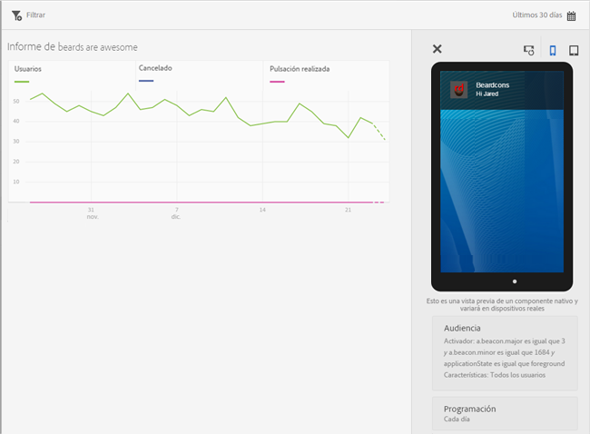
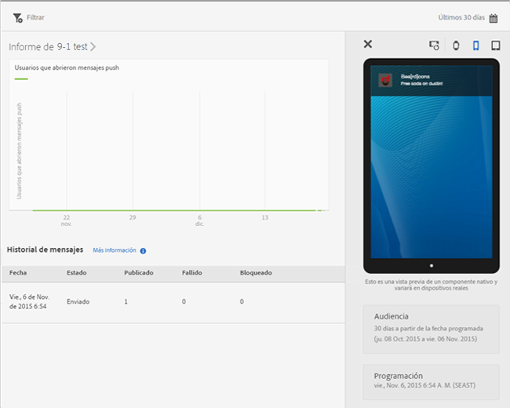

# Ver informes de mensajes {#view-message-reports}

Puede ver informes de los mensajes push y los mensajes en la aplicación.

1. Haga clic en  en la columna **[!UICONTROL Informe]** de un mensaje.
1. (**Opcional**) Cree un filtro adhesivo para el informe o cambie el intervalo de tiempo haciendo clic en el icono de **[!UICONTROL Calendario]**.

   Para obtener más información sobre la creación de un filtro adhesivo, consulte [Agregar un filtro adhesivo](/help/using/usage/reports-customize/t-sticky-filter.md).

>[!TIP]
>
>En función del tipo de mensaje que visualice, el informe puede variar.

## Mensajes en la aplicación {#section_90B79BA58E8141F78538C187EB1BF8C7}

Si visualiza informes para un mensaje en la aplicación, se parecerán a la siguiente ilustración:

### Métricas de mensajes en la aplicación

Esta es una lista de las métricas disponibles para los mensajes en la aplicación:

* **[!UICONTROL Impresión]**, cuando se activa un mensaje.

* **[!UICONTROL Pulsación]**, cuando un usuario presiona el botón **[!UICONTROL Pulsación]** en una alerta o un mensaje a pantalla completa y cuando abre la aplicación desde una notificación local.

* **[!UICONTROL Cancelar]**, cuando un usuario presiona el botón **[!UICONTROL Cancelar]** en una alerta o un mensaje a pantalla completa.

* **[!UICONTROL Tasa de participación]**, esta es una métrica calculada de Adobe Analytics y es el resultado de dividir el número de pulsaciones entre el número de impresiones.

## Mensajes push {#section_BEAFD858CA194185B6F88903446058E9}

Si visualiza informes para un mensaje push, se parecerán a la siguiente ilustración:

El gráfico de la parte superior muestra el número de usuarios que abrieron el mensaje.

### Métricas de mensajes push

Esta es una lista de las métricas disponibles para los mensajes push:

* **[!UICONTROL Fecha]**

   Momento en que se insertó el mensaje en los dispositivos desde Mobile Services.

* **[!UICONTROL Estado]**

   El estado del mensaje y los estados disponibles son:

   * **[!UICONTROL Cancelado]**
   * **[!UICONTROL Programado]**
   * **[!UICONTROL En ejecución]**
   * **[!UICONTROL Ejecutado]**

* **[!UICONTROL Publicadas]**

   El número de tokens de dispositivo enviados correctamente al servicio de notificaciones push de Apple/la mensajería de Firebase Cloud (APNS/FCM) por mandar el mensaje a los dispositivos de los usuarios.

* **[!UICONTROL Fallido]**

   El número de tokens de dispositivo que no se han enviado correctamente a APNS/FCM. Algunas posibles razones de los errores:

   * El pushID no es válido

   * La plataforma push (APNS, FCM, etc.) elegida para insertar el mensaje no existe en la aplicación del trabajo. Por ejemplo, la plataforma puede recopilar tokens push de iOS pero no tiene configurado el servicio APNS.

   * Es posible que el mensaje haya fallado porque el servicio push no se configuró correctamente o porque el sistema de Mobile Services está inactivo.
   >[!IMPORTANT]
   >
   >Si tiene un número inusualmente alto de errores, compruebe la configuración de los servicios push. Si los servicios push parecen estar correctamente configurados, contacte con el Servicio de atención al cliente de Adobe.

* **[!UICONTROL Incluido en la lista de bloqueados]**

   El número de tokens de dispositivo que ya no son válidos para su envío a APNS o FCM. Esto suele significar que la aplicación se ha desinstalado del dispositivo o que el usuario ha cambiado la configuración relacionada con la recepción de mensajes. Android e iOS difieren en cuanto al momento en el que se contabilizan los tokens como bloqueados. Los tokens de Android se muestran inmediatamente en la lista de bloqueados. Los tokens de iOS se muestran inicialmente como publicados, pero en función de los comentarios de APNS, se muestran en una lista de bloqueados en los mensajes posteriores.
