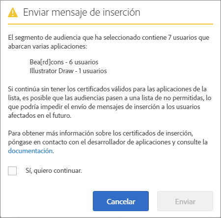

# Audiencia: mensajes push{#audience-define-and-configure-audience-segments-for-push-messages}

Puede definir y configurar las opciones de audiencia para los mensajes push, incluidas las opciones de intervalos de fechas, segmentos de Analytics y segmentos personalizados.

## Define audience segments {#section_7C4D2393CF7441959FE2381A02867CAC}

Cuando se crea un segmento de audiencia para mensajería push, este podría incluir a usuarios de una o varias aplicaciones porque los grupos de informes o los grupos de informes virtuales pueden contener datos de una aplicación o más. Para obtener información sobre los grupos de informes virtuales, consulte [Virtual report suites](/help/using/manage-apps/c-mob-vrs.md).

En Adobe Mobile Services, los especialistas en marketing solo pueden insertar en una aplicación por plataforma. Si los especialistas en marketing intentan insertar en segmentos que contengan usuarios de varias aplicaciones, se muestra una advertencia en la que se indica que continuar puede provocar errores graves de inserción y el posible bloqueo de los usuarios. Si se produce un error de inserción, consulte *Resolver errores de mensajes push* en [Troubleshooting push messaging](/help/using/in-app-messaging/t-create-push-message/c-schedule-push-message.md).

Para usar datos de Audience Manager en su definición de segmento, consulte [Audience Analytics](https://docs-author-stg.corp.adobe.com/content/help/en/analytics/integration/audience-analytics/mc-audiences-aam.html).

>[!IMPORTANT]
>
>If app users are blacklisted, marketers can **never** send push messages to those affected users again.

Si selecciona un segmento de audiencia que contiene usuarios en varias aplicaciones, puede ver la siguiente alerta:

The app name is based on the pared down version of the appId, which is automatically sent to Adobe Analytics by the Mobile Services SDK in the `<app name> <version number> (<bundle id>)` format.

>[!TIP]
>
>The version number is optional.

De la versión, se eliminan hasta 6 conjuntos de números y, del identificador del paquete, se eliminan hasta 5.

Por ejemplo:

* `Bea[rd]cons 1.0 (123)` will appear as `Bea[rd]cons`
* `Bea[rd]cons 1.2 (1.2)` will appear as `Bea[rd]cons`
* `Bea[rd]cons 1.2.3.4.5.6.7 (1111)` will appear as `Bea[rd]cons .7`
* `Bea[rd]cons 1.2.3. (1.2.3.4.5.6)` aparecerá como `Bea[rd]cons (.6)`

Para enviar el mensaje push a las aplicaciones de la lista, seleccione la casilla de verificación **Yes, I want to proceed (Sí, deseo continuar).** y haga clic en **[!UICONTROL Enviar]**.

## Prácticas recomendadas

Estas son algunas de las prácticas recomendadas para recordar:

* Para reducir las confusiones, **evite** definir grupos de informes virtuales de aplicación móvil que contengan datos de varias aplicaciones.
* Use un identificador de aplicación único como parte de un segmento de audiencia **siempre** que quiera enviar un mensaje push.
Esto garantiza que las notificaciones push se envíen a un segmento de audiencia que **solo** pertenezca a una aplicación.

### Ejemplos

Estos ejemplos le ayudarán a entender cómo definir los segmentos debidamente:

**Correcto**: el especialista en marketing proporciona certificados de inserción para las versiones iOS y Android de una aplicación, por ejemplo, Adobe Photoshop. Puede enviar una notificación push a un segmento de usuarios que abarque las dos plataformas.

**Incorrecto**: los especialistas en marketing proporcionan certificados de inserción para las versiones iOS y Android de una aplicación, por ejemplo, Adobe Photoshop. Si el especialista en marketing realiza la inserción en un segmento de *todos los usuarios activos en los últimos 30 días*, solo los usuarios de la aplicación Adobe Photoshop para iOS y Android recibirán la inserción, y todos los usuarios de la aplicación Adobe Illustrator para iOS y Android estarán bloqueados. Si desea ver un ejemplo más detallado, consulte *Resolver errores de mensajes push* en [Solucionar los problemas de la mensajería push](/help/using/in-app-messaging/t-create-push-message/c-troubleshooting-push-messaging.md).

## Configure audience segments {#section_A92C60885A30421B8150820EC1CCBF13}

1. Vaya a la página Audiencia para ver un nuevo mensaje push.

   For more information, see [Create a push message](/help/using/in-app-messaging/t-create-push-message/t-create-push-message.md).

   As you configure the audience options, remember the following **important** information:

   * La **[!UICONTROL Audiencia participante estimada]** es el número de dispositivos que se ajustan al segmento de Adobe Analytics **y** el número de dispositivos participantes.

      Puede ver una estimación del número de usuarios que hay en los segmentos seleccionados que han elegido recibir mensajes y que recibirán el mensaje push. El número total de usuarios de la aplicación aparece debajo de la estimación independientemente del estado de inclusión.

   * El **[!UICONTROL Total]es el número de dispositivos que se ajustan al segmento de Adobe Analytics.**

   * Push messages are sent to the devices that are part of a defined Adobe Analytics segment **and** that have opted-in for push messages.

      Esto significa que el SDK ha enviado el valor `True` en la eVar Inclusión del mensaje push.

   * Aunque el dispositivo tenga un token de dispositivo válido, a menos que Adobe Analytics haya establecido el indicador de selección, el mensaje no se inserta en el dispositivo.

   * Para obtener más información sobre la solución de problemas con la mensajería push, consulte estos temas:

      * [Mensajería push en iOS](https://docs.adobe.com/content/help/en/mobile-services/ios/messaging-ios/push-messaging/push-messaging.html)

      * [Mensajería push en Android](https://docs.adobe.com/content/help/en/mobile-services/android/messaging-android/push-messaging/push-messaging.html)

1. Rellene los campos siguientes:

   * **[!UICONTROL Durante el]**

      Escriba el lapso de tiempo para la audiencia estimada. En la lista desplegable **[!UICONTROL Durante el], seleccione una opción:**

   * **[!UICONTROL Último]** permite seleccionar un lapso de tiempo relativo (por ejemplo, los últimos 7, 30 o 60 días) desde el momento en el que el mensaje está programado para su inserción.

      Por ejemplo, si selecciona los últimos 30 días y programa la inserción del mensaje para el 31 de octubre, la audiencia estimada sería el número de usuarios que han decidido recibir mensajes push los 30 días anteriores al 31 de octubre.

   * **[!UICONTROL Intervalo estático]** permite seleccionar un intervalo estático mediante la selección de las fechas de inicio y fin para el rango de audiencia estimado.

      En el ejemplo anterior, si selecciona un intervalo de fechas del 1 al 15 de octubre, pero programa la inserción del mensaje para el 31 de octubre, la audiencia estimada sería el número de usuarios que han elegido recibir mensajes push en el intervalo de fechas estático especificado (del 1 al 15 de octubre).

   * **[!UICONTROL Segmentos de Analytics]**

      Select an existing Adobe Analytics segment from the drop-down list. For more information, see [Build segments](https://docs.adobe.com/content/help/en/analytics/components/segmentation/segmentation-workflow/seg-build.html).

   * **[!UICONTROL Segmentos personalizados]**

      Select a metric or variable from the drop-down list (for example, **[!UICONTROL Days Since Last Use]** or **[!UICONTROL Point of Interest]**) and configure the filter as desired. Por ejemplo, el siguiente segmento personalizado está dirigido a los usuarios que disponen de un teléfono móvil con iOS y que se encuentran en la región de California (Estados Unidos).
   >[!IMPORTANT]
   >
   >In the **[!UICONTROL Create Audience]** section, if you click **[!UICONTROL And]**, a dialog box appears that reminds you to ensure that each app that is listed **must** have a valid certificate. If you clicked **[!UICONTROL Or]**, the default dialog box appears. For more information about valid certificates and report suites, see [Virtual report suites](/help/using/manage-apps/c-mob-vrs.md).
