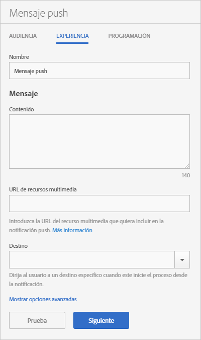

# Experience: Mensaje push {#experience-push-message}

Puede configurar opciones de experiencia para mensajes push y mensajes push enriquecidos, incluidos el nombre, el texto del mensaje y las opciones de destino. También puede configurar opciones avanzadas, incluidas las opciones de carga útil y las opciones personalizadas para dispositivos iOS.

1. En la página Audience para un nuevo mensaje push, haga clic en **[!UICONTROL Experience]**.

   

1. Escriba el nombre del mensaje.
1. Rellene los campos siguientes de la sección **[!UICONTROL Mensaje]**:

   * **[!UICONTROL Contenido]**

      Especifique el texto del mensaje. Puede especificar hasta un máximo de 140 caracteres.

   * **[!UICONTROL URL de recursos multimedia]**

      Escriba la URL del archivo multimedia que va a usar en el mensaje de notificación push. Para conocer los requisitos para utilizar notificaciones push enriquecidas, consulte *Requisitos para notificaciones push enriquecidas* a continuación.

      >[!IMPORTANT]
      >
      >Para mostrar una imagen o un vídeo en una notificación push, recuerde lo siguiente:
      > * El dato `attachment-url` se gestiona en la carga útil push.
      > * La URL de recursos multimedia debe ser capaz de gestionar solicitudes de picos.

   * **[!UICONTROL Destino]**

      Seleccione un destino específico, como un vínculo web, profundo o híbrido, para enviar a los usuarios cuando pulsen en el mensaje. Para obtener más información, consulte [Destinos](/help/using/acquisition-main/c-create-destinations.md).

      >[!TIP]
      >
      >Cuando se usan los tipos de destino * **[!UICONTROL Vínculo web]** o **[!UICONTROL Vínculo personalizado]**, no se realiza un seguimiento del tipo de destino. Solo se hace un seguimiento de los **[!UICONTROL vínculos profundos]**.

## Requisitos de las notificaciones push enriquecidas

Estos son los requisitos para enviar notificaciones push enriquecidas:

* **Versiones admitidas**

   Las notificaciones push enriquecidas son compatibles con las siguientes versiones:
   * Android 4.1.0 o posterior
   * iOS 10 o posterior

      >[!IMPORTANT]
      >
      >Recuerde la información siguiente:
      >* Los mensajes push enriquecidos enviados a versiones anteriores se entregarán, pero solo se verá el texto.
      >* En este momento no se ofrece compatibilidad de visualización.

* **Formatos de archivo**

   Estos son los formatos de archivo admitidos:
   * Imágenes: JPG y PNG
   * Animaciones (solo iOS): GIF
   * Vídeos (solo iOS): MP4

* **Formatos de URL**
   * Solo HTTPS

* **Tamaño**
   * Las imágenes deben tener el formato 2:1; si no, se recortarán.

Para obtener más información sobre cómo configurar notificaciones push enriquecidas, consulte los siguientes temas:

* [Recibir notificaciones push en Android](/help/android/messaging-main/push-messaging/c-set-up-rich-push-notif-android.md)
* [Recibir notificaciones push enriquecidas en iOS](/help/ios/messaging-main/push-messaging/c-set-up-rich-push-notif-ios.md)

Para configurar un mensaje push en la página Experience:

1. (**Opcional**) Haga clic en el vínculo **[!UICONTROL Mostrar opciones avanzadas]** para configurar las opciones adicionales:

   * **[!UICONTROL Carga útil: datos]**

      Proporcione una carga útil push personalizada en JSON que se enviará a la aplicación mediante una notificación push o local. El límite para Android e iOS es de 4 KB.

   * **[!UICONTROL Opciones de Apple: categoría]**

      Proporcione una categoría para las notificaciones push o locales. Para obtener más información, consulte [Gestión del soporte para notificaciones de su aplicación](https://developer.apple.com/library/content/documentation/NetworkingInternet/Conceptual/RemoteNotificationsPG/SupportingNotificationsinYourApp.html#//apple_ref/doc/uid/TP40008194-CH4-SW9) en la *biblioteca para desarrolladores de iOS*.

   * **[!UICONTROL Opciones de Apple: sonido]**

      Proporcione el nombre del archivo de sonido en el paquete de aplicaciones que se debe reproducir. Se establece si no se reproduce un sonido de alerta predeterminado. Para obtener más información, consulte [Gestión del soporte para notificaciones de su aplicación](https://developer.apple.com/library/content/documentation/NetworkingInternet/Conceptual/RemoteNotificationsPG/SupportingNotificationsinYourApp.html#//apple_ref/doc/uid/TP40008194-CH4-SW10) en la *biblioteca para desarrolladores de iOS*.

   * **[!UICONTROL Opciones de Apple: contenido disponible]**

      Seleccione esta opción para que, cuando el mensaje llegue, iOS active la aplicación en segundo plano y le permita ejecutar código basado en la carga útil del mensaje. Para obtener más información, consulte la sección [Servicio de producción de notificaciones push de Apple](https://developer.apple.com/library/content/documentation/NetworkingInternet/Conceptual/RemoteNotificationsPG/APNSOverview.html#//apple_ref/doc/uid/TP40008194-CH8-SW1) en la *biblioteca para desarrolladores de iOS*.

1. (Opcional) Obtenga una vista previa del diseño del mensaje haciendo clic en los siguientes iconos:

   * **[!UICONTROL Resumen x]**

      Oculta el panel de vista previa. Haga clic en  para mostrar de nuevo el panel de vista previa.

   * **[!UICONTROL Cambiar la orientación]**

      Para cambiar la orientación de la vista previa del modo vertical al horizontal, haga clic en . En el caso de los relojes, la orientación cambia de una esfera de reloj redonda a una cuadrada.

   * **[!UICONTROL Vista previa en el reloj de un usuario]**

      Para obtener una vista previa del mensaje tal como aparecerá en los relojes de un usuario, haga clic en el .

   * **[!UICONTROL Vista previa en el teléfono móvil de un usuario]**

      Para obtener una vista previa del mensaje tal como aparecerá en los teléfonos móviles de un usuario, haga clic en el .

   * **[!UICONTROL Vista previa en la tableta del usuario]**

      Para obtener una vista previa del mensaje en la tableta del usuario, haga clic en el .
   En la parte inferior del panel de vista previa, puede ver una descripción de la audiencia que seleccionó en el paso anterior.

1. (**Opcional**) Haga clic en **[!UICONTROL Probar]** con el fin de insertar el mensaje en los dispositivos especificados para la realización de pruebas.
1. Seleccione el servicio y escriba los tokens push de al menos un dispositivo donde desee insertar el mensaje.

   Especifique los tokens en una lista separada por comas para insertar el mensaje en más de un dispositivo.

1. Configure las opciones de programación del mensaje.

   Para obtener más información, consulte [Programación: mensaje push](/help/using/in-app-messaging/t-create-push-message/c-schedule-push-message.md).
