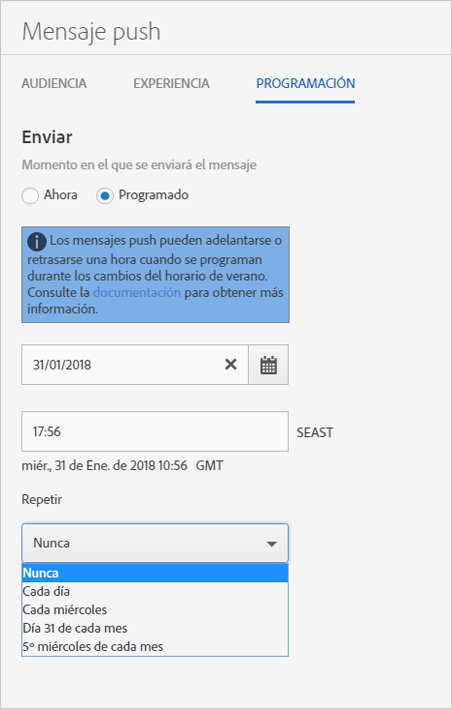

# Programar: mensajes push{#schedule-push-message}

En la interfaz de usuario de Adobe Mobile Services, puede programar un mensaje push para que se entregue inmediatamente, más tarde o como evento recurrente. Estos eventos se pueden programar con periodicidad diaria, semanal o mensual.

>[!TIP]
>
>Los usuarios pueden modificar la configuración de programación de un trabajo de mensaje push en cualquier momento. Si la fecha para enviar un mensaje con programación recurrente no existe, por ejemplo, un trabajo con recurrencia mensual todos los días 31, el día 31 de febrero (o quinto martes del mes) no se envía ningún mensaje.

Recuerde la información siguiente:

* El formato correcto de fecha y hora es `hh:mm` y `mm/dd/yyyy`.

* Un mensaje programado se puede editar del modo siguiente:

   * Cambie la fecha a una fecha posterior.
   * Se puede cambiar el intervalo de repetición por otro intervalo.

      Por ejemplo, si originalmente tenía un mensaje que se enviaba todos los días, puede modificar la recurrencia para que sea mensual.

## Antes de programar mensajes push recurrentes

Antes de programar mensajes push recurrentes, **debe** saber lo siguiente:

* Las opciones que se muestran en la lista desplegable **[!UICONTROL Repetir]dependen de la fecha que escriba o seleccione.**

   For example, if you typed , the following options are displayed:`Saturday, October 7`

   * **[!UICONTROL Nunca]**
   * **[!UICONTROL Cada día]**
   * **[!UICONTROL Cada sábado]**
   * **[!UICONTROL Día 7 de cada mes]**
   * **[!UICONTROL Primer sábado de cada mes]**

* Los mensajes push se programan y envían según la hora del meridiano de Greenwich (GMT).

   Por ejemplo, si programa un mensaje recurrente para que se envíe todos los sábados a las 12:00 (mediodía) **PST**, a partir del 7 de octubre el mensaje se enviará los sábados a las 19:00 **GMT**.
* Los mensajes se envían de forma distinta dependiendo de si se encuentra en EE. UU., Europa o Asia.

   Por ejemplo, si está en San José (California), y programa un mensaje para que se envíe el ***31 de octubre*** a las 17:30 **PST**, este se enviará el ***1 de noviembre*** a las 00:30 **GMT**. Si se halla en Tokio y programa un mensaje para que se envíe el ***1 de enero*** a las 5:30, se enviará el ***31 de diciembre*** a las 20:30 **GMT**.
* Los mensajes push se envían una hora antes o después, según el horario de ahorro energético.
* Al consultar el informe de los mensajes push, estos se muestran en la zona horaria local configurada en su sistema.

   Por ejemplo, si la hora de inicio son las 12:00 **PST**, aunque el mensaje se envíe a las 19:00 **GMT**, en el informe se indicará que la hora de envío fue las 12:00 **PST**.

## Schedule a recurring push message {#section_675BD754E5A04423A1751193698A978F}

1. On the Schedule page for a new push message, select Scheduled or Now.********

   For more information, see [Create a push message](/help/using/in-app-messaging/t-create-push-message/t-create-push-message.md).

   If you selected **[!UICONTROL Now]**, the message is pushed immediately. Para evitar que el mensaje se programe inmediatamente, haga clic en **[!UICONTROL Guardar como borrador]**.

   

1. If you selected **[!UICONTROL Scheduled]**, click the calendar icon and select or type a start date.
1. Escriba una hora. 
1. Under **[!UICONTROL Repeat]**, select one of the following options:

   * **[!UICONTROL Nunca]**
   * **[!UICONTROL Cada día]**
   * **[!UICONTROL Cada miércoles]**
   * **`<Day x>`of the month**

      Las opciones mostradas cambian dependiendo del día que seleccione o escriba como fecha de inicio.
   * **`<nth day>`of Every Month**

      El valor mostrado cambia dependiendo de la fecha que haya seleccionado o escrito como fecha de inicio.

1. In **[!UICONTROL End Repeat]**, type an end date and time.
1. Haga clic en una de las opciones siguientes:

   * **[!UICONTROL Guardar como borrador]**

      Esta opción guarda el mensaje en el formato de borrador. Puede elegir esta opción, bien para guardar un mensaje no terminado, o bien para guardar un mensaje a fin de que otro usuario pueda editarlo y aprobarlo antes de activarlo.

      If you selected **[!UICONTROL Now]** in the previous step, the draft message is sent immediately on activation. Si ha seleccionado una fecha y una hora para insertar el mensaje, éste se inserta según esta programación.

   * **[!UICONTROL Guardar y programar]**

      Esta opción envía el mensaje en el día y la hora programados.

Para insertar el borrador del mensaje más tarde, realice una de estas tareas:

* Click **[!UICONTROL Manage Messages]**, select the check box next to the message, and click **[!UICONTROL Activate Selected]**.
* Haga clic en **[!UICONTROL Guardar y enviar]para guardar el mensaje y enviarlo.**
