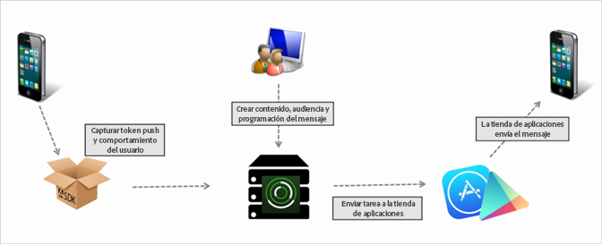

# Crear un mensaje push {#create-a-push-message}

Puede enviar mensajes push a segmentos de Analytics desde la interfaz de usuario de Mobile Services para sacar partido de los eficaces datos de Analytics al interactuar con los usuarios.

>[!IMPORTANT]
>
>Antes de crear un mensaje push, consulte [Requisitos previos para activar la mensajería push](/help/using/c-manage-app-settings/c-mob-confg-app/configure-push-messaging/prerequisites-push-messaging.md).

Los mensajes push los ven los usuarios que han elegido la opción de recibir notificaciones cuando no están usando la aplicación activamente. Estas notificaciones los alertan acerca de nuevas actualizaciones, ofertas y recordatorios. Con estas notificaciones, puede crear, probar, administrar e informar sobre mensajes push en un flujo de trabajo racionalizado.

Los mensajes push los envían, desde el lado del servidor, las tiendas de aplicaciones, no se envían desde Adobe Mobile Services:

Para crear un mensaje push:

1. Click ***your_app_name*** &gt; **[!UICONTROL Messaging]** &gt; **[!UICONTROL Manage Messages]** &gt; **[!UICONTROL Create Message]** &gt; **[!UICONTROL Create Push]**.
1. Configure las opciones de audiencia.

   Para obtener más información, consulte [Audiencia: defina y configure segmentos de audiencia para los mensajes push](/help/using/in-app-messaging/t-create-push-message/c-audience-push-message.md).
