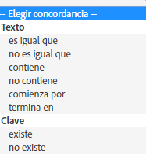

# Audience: Mensaje en la aplicación {#audience-in-app-message}

Puede configurar las opciones de audiencia para los mensajes en la aplicación, incluidas las opciones de visualización, activadores y características.

1. In your app, click **[!UICONTROL Messaging]** > **[!UICONTROL Manage Messages]** > **[!UICONTROL Create Message]** > **[!UICONTROL Create In-App]**.
1. En la página Audiencia, rellene los campos siguientes:

   * **[!UICONTROL Ver]**

      Seleccione la opción que activa la visualización de un mensaje:

      * **[!UICONTROL Siempre]**

         Con esta opción, el mensaje se muestra siempre que se produce la activación.

      * **[!UICONTROL Una vez]**

         Con esta opción, el mensaje se muestra solo la primera vez que se produce la activación.

      * **[!UICONTROL Hasta la pulsación]**

         Con esta opción, el mensaje se muestra siempre que se produce la activación hasta que el usuario hace clic. Esta activación solo se aplica en la pantalla completa y los mensajes de alerta. La mayoría de los mensajes tienen que redireccionarse o emplear un recurso de Internet y no se muestran si no hay conexión. Para mostrar siempre el mensaje, con independencia de la conectividad de red, seleccione la casilla de verificación **[!UICONTROL Mostrar sin conexión]**.
   * **[!UICONTROL Activador]**

      Seleccione una opción en la lista desplegable y elija una condición. Por ejemplo, puede seleccionar **[!UICONTROL Iniciado]** en la primera lista desplegable y **[!UICONTROL Existe]** en la segunda. También puede especificar datos de contexto personalizados que tengan que estar en la visita de activación para mostrar el mensaje.

      >[!IMPORTANT]
      >
      >Si selecciona varios activadores, todos deben producirse en la misma visita para que el mensaje se muestre.

   * **[!UICONTROL Características]** Puede determinar quién debe ver el mensaje en la aplicación cuando se activa y filtrar (segmentar) la audiencia según las visitas que contengan datos concretos. Por ejemplo, puede definir una regla en la que Puntos de interés contengan Denver. Este filtro le permite mostrar el mensaje a los clientes que estén en uno de sus puntos de interés con Denver en el nombre, en el momento de activar el mensaje.

## Información adicional sobre características y activadores {#section_48C39EFB8CAA4F62B994FCC91DF588E6}

>[!IMPORTANT]
>
>Los activadores y las características usan datos que se pasan a Analytics desde su aplicación. Estos valores se pasan como datos de contexto, variables asignadas y métricas. Una variable es un valor basado en texto y una métrica es un valor numérico.

To see the mapping of these key value pairs in the Mobile Services UI and validate the value for your trigger, click **[!UICONTROL Manage App Settings]** >  **[!UICONTROL Manage Variables &amp; Metrics]** >, which displays the following tabs:

* **[!UICONTROL Variables y métricas estándar]**
* **[!UICONTROL Variables personalizadas]**
* **[!UICONTROL Métricas personalizadas]**

Después de validar la asignación, seleccione el valor coincidente apropiado o el operador lógico para configurar su audiencia para el mensaje.

### Selección de métricas y variables {#example_AB126F03BD1C4094B791E230B3DB1189}

Los siguientes escenarios le ayudan a determinar si desea seleccionar una métrica o una variable como su activador:

### Métricas

Una métrica es un número y un ejemplo es el número de compras.

1. Click **[!UICONTROL Manage Messages]** > **[!UICONTROL Create Message]**.
1. Complete los siguientes pasos en la sección **[!UICONTROL Activador]** en la pestaña **[!UICONTROL Audiencia]**:

   1. Seleccione un evento estándar como **[!UICONTROL Iniciado]** y seleccione **[!UICONTROL Existe]**.
   1. Seleccione un segundo activador que es un punto de datos personalizado y que está asignado a una métrica.
   1. En **[!UICONTROL Número]** seleccione una opción coincidente.

### Variables

Una variable es una cadena de texto que es un identificador único, por ejemplo, país, aeropuerto, etc.

1. Click **[!UICONTROL Manage Messages]** > **[!UICONTROL Create Message]**.
1. Complete los siguientes pasos en la sección **[!UICONTROL Activador]** en la pestaña **[!UICONTROL Audiencia]**:

   1. Seleccione un evento estándar como **[!UICONTROL Iniciado]** y seleccione **[!UICONTROL Existe]**.
   1. Seleccione un segundo activador que es un punto de datos personalizado y que está asignado a una variable.
   1. En **[!UICONTROL Texto]** seleccione una opción coincidente.

Para obtener más información sobre los datos de contexto, variables y métricas, vea [Administrar su aplicación](/help/using/manage-apps/manage-apps.md).
