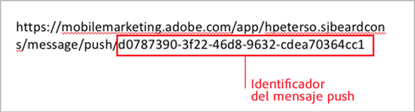
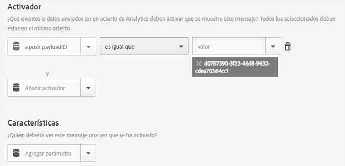

# Activador de mensajes en la aplicación al abrirla mediante un mensaje push{#trigger-an-in-app-message-when-the-app-is-opened-from-a-push-message}

{#eol}

Puede configurar el activador de mensajes en la aplicación para que este sea el ID del mensaje push que se envía cuando un usuario abre la aplicación mediante el mensaje push.

1. Obtenga el ID del mensaje push que se enviará al usuario.

   Puede encontrar el ID del mensaje push en la URL durante el flujo de trabajo de creación del mensaje.

   Vea el siguiente ejemplo:

   

1. Guarde y active el mensaje en la aplicación con el siguiente activador:

   `"a.push.payloadID" =`

   >[!TIP]
   >
   >El ID del mensaje push corresponde al ID que utilizó en el paso 1.

   El activador debe añadirse manualmente, ya que no está disponible en la lista desplegable **[!UICONTROL Activador]**.

   

1. Guarde y envíe el mensaje push que tenga el ID de push del paso 1.
1. Haga clic en el mensaje push para abrir la aplicación y verificar que el mensaje en la aplicación se muestre al abrirla.

   Mientras realice las pruebas, recuerde la siguiente información:

   * Después de guardar el mensaje en la aplicación, el archivo de configuración alojado tarda unos 45 segundos en actualizarse con el nuevo mensaje.
   * La aplicación busca actualizaciones del archivo de configuración (el nuevo mensaje en la aplicación) cuando hay un **new** , por lo que debe asegurarse de que la aplicación está activando un nuevo inicio al hacer clic en el mensaje push.
   Esto suele significar que debe asegurarse de que se ha agotado el tiempo de espera de la sesión. El tiempo de espera predeterminado es de 5 minutos.
