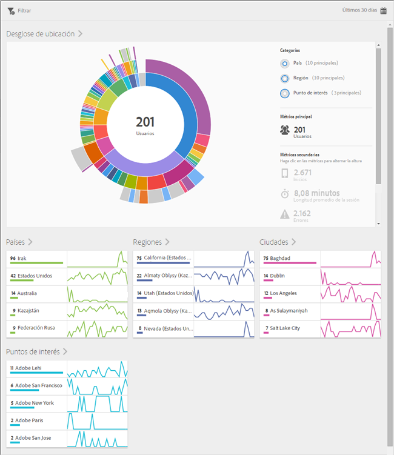
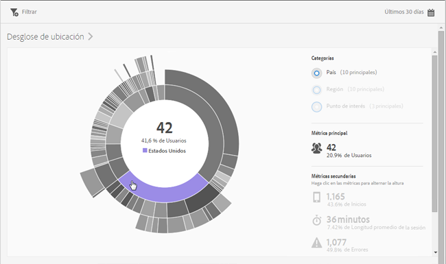
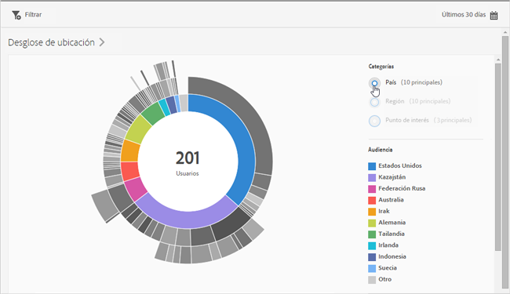
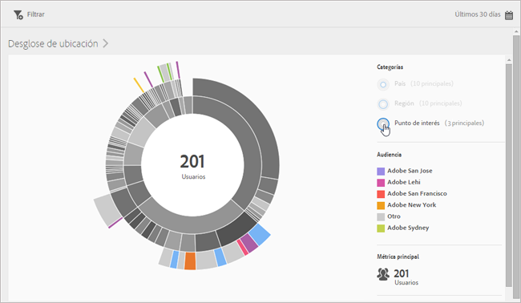
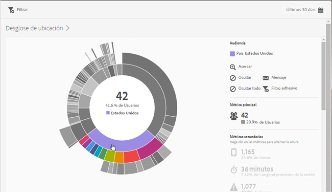
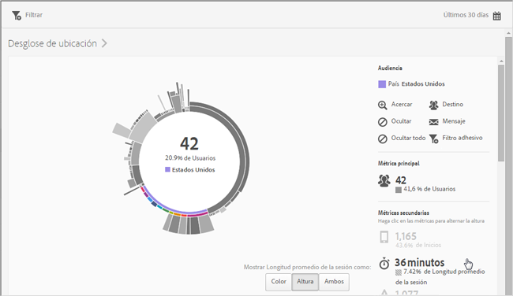
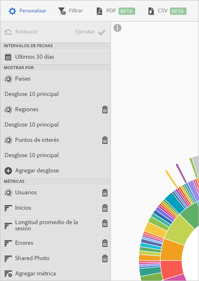

# Información general (ubicación){#overview-location}

El informe **[!UICONTROL Información general de la ubicación]** le permite ver los diferentes países, regiones y puntos de interés en los que se utiliza la aplicación.

Este informe ofrece una visualización de destello solar de los datos existentes. Lo puede usar para descubrir segmentos de audiencias (conjuntos de visitantes) a los que desee dirigirse. Crear y administrar audiencias es similar a crear y usar segmentos, con la diferencia de que las audiencias se pueden publicar en Experience Cloud.

A continuación se proporciona información adicional sobre este informe:

## Navegación y uso {#section_4A88C3849B5847BF8CF433CCFD99FDC3}

Esta visualización proporciona, por ejemplo, el informe principal con los desgloses. La visualización utiliza la altura para mostrar la métrica objetivo y las diferencias de rendimiento entre las métricas. Cada anillo representa un segmento de audiencia en la categoría del anillo. Puede realizar acciones en una audiencia, como aplicar un filtro adhesivo y ocultar o ver métricas.

>[!TIP]
>
>Además de esta información, puede ver el tutorial incluido en el producto, que describe cómo interactuar con el gráfico radial. Para iniciar el tutorial, haga clic en **[!UICONTROL Desglose de ubicación]** en la barra de título del informe y, a continuación, haga clic en el icono **[!UICONTROL i]**.

El gráfico de destello solar es interactivo. Para cambiar el período de tiempo, haga clic en el icono del **[!UICONTROL calendario]** en la parte superior derecha. Sitúe el ratón encima de cualquier parte del gráfico para mostrar más información. Por ejemplo, en la siguiente ilustración puede ver el número total y el porcentaje de usuarios que utilizan la aplicación en Estados Unidos.

En esta ilustración, los botones de la sección **[!UICONTROL Categorías]** situada en la esquina superior derecha permiten alternar entre la visualización de información sobre los diez países y regiones principales y los tres **[!UICONTROL puntos de interés]** principales.

Esta es la visualización cuando selecciona **[!UICONTROL País]**:

Esta es la visualización cuando selecciona **[!UICONTROL Puntos de interés]**:

Puede hacer clic en un trozo del anillo para seleccionar la audiencia en la que puede realizar acciones, como ampliar, ocultar audiencias y crear un mensaje en la aplicación o un filtro adhesivo.

Puede hacer clic en una métrica secundaria en el lado derecho para agregarla a la visualización y mostrarla usando el color, la altura o ambos.

## Agregar desgloses y métricas {#section_15833511E82648869E7B1EFC24EF7B82}

Puede agregar desgloses y métricas secundarias, que modifican la altura de cada audiencia en relación con otras audiencias del gráfico.

>[!TIP]
>
>Cuantos más anillos agregue al gráfico radial, más tardará este en procesarse.

Para agregar desgloses y métricas secundarias, haga clic en **[!UICONTROL Desglose de ubicación]** en la barra de título del informe y, a continuación, haga clic en **[!UICONTROL Personalizar]** para abrir el carril derecho.

Al hacer clic en **[!UICONTROL Agregar desglose]** o **[!UICONTROL Agregar métrica]**, se muestra un nuevo elemento con el mismo nombre que el elemento anterior en la lista correspondiente. Haga clic en el desglose o la métrica que acaba de crear para acceder a una lista desplegable desde la que podrá seleccionar un elemento nuevo.

## Crear un filtro adhesivo {#section_365999D49FC744ECBF9273132497E06C}

Haga clic en un trozo del anillo a fin de seleccionar la audiencia para la que desea crear un filtro adhesivo y, a continuación, haga clic en **[!UICONTROL Filtro adhesivo]**. El filtro adhesivo le permite aplicar los filtros actuales y ejecutar un informe nuevo basado en los filtros.

## Uso compartido de informes {#section_F8AF2AA73D4C4C008976D45847F82D0B}

Después de crear un informe, sus ajustes se usan para crear una dirección URL personalizada, que puede copiar y compartir.

## Información adicional

Para obtener más información sobre la ubicación, consulte los siguientes temas:

* [Mapa](/help/using/location/c-map-points.md)
* [Administrar puntos de interés](/help/using/location/t-manage-points.md)