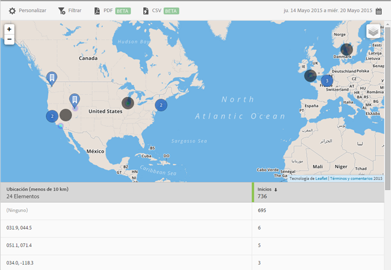

# Mapa {#map}

You can view an interactive map that displays your POI and other data markers.

Here is some important information to remember:

* You can increase or decrease the size of the map.

   Esta función resulta útil, por ejemplo, si tiene dos puntos de interés que estén próximos entre sí. Al aumentar el mapa, podrá verlo con mayor detalle.
* Los puntos de interés se muestran en azul.

   Otros marcadores de datos, como los inicios, se muestran en negro. Haga clic en un marcador para ver más información.

Click  to select the following options:

* **[!UICONTROL Mapa]**

   Muestre un mapa sencillo.

* **[!UICONTROL Satélite]** Muestra el mapa en modo satélite.

* **[!UICONTROL Marcadores de datos]**

   Elija si desea mostrar los marcadores de datos de color negro.

* **[!UICONTROL Mapa de calor]**

   Elija si desea mostrar los marcadores del mapa de calor. Cuanto mayor sea la intensidad del color, con más frecuencia se cumple la condición (usos, por ejemplo).

* **[!UICONTROL Puntos de interés]**

   Elija si desea mostrar sus puntos de interés.

Para este informe, puede configurar las siguientes opciones:

* **[!UICONTROL Período de tiempo]**

   Haga clic en el icono de **[!UICONTROL calendario]para seleccionar un período de tiempo personalizado o elegir un período de tiempo preestablecido en la lista desplegable.**

* **[!UICONTROL Personalizar]**

   Customize your reports by changing the **[!UICONTROL Show By]** options, adding metrics and filters, and adding additional series (metrics), and more. For more information, see [Customize reports](/help/using/usage/reports-customize/t-reports-customize.md).

* **[!UICONTROL Filtro]**

   Haga clic en **[!UICONTROL Filtro]para crear un filtro que incluya distintos informes con el fin de ver el comportamiento de un segmento en todos los informes móviles.** Un filtro adhesivo permite definir un filtro que se aplica a todos los informes sin rutas. For more information, see [Add a sticky filter](/help/using/usage/reports-customize/t-sticky-filter.md).

* **[!UICONTROL Descargar]**

   Click **[!UICONTROL PDF]** or **[!UICONTROL CSV]** to download or open documents and share with users who do not have access to Mobile Services or to use the file in presentations.