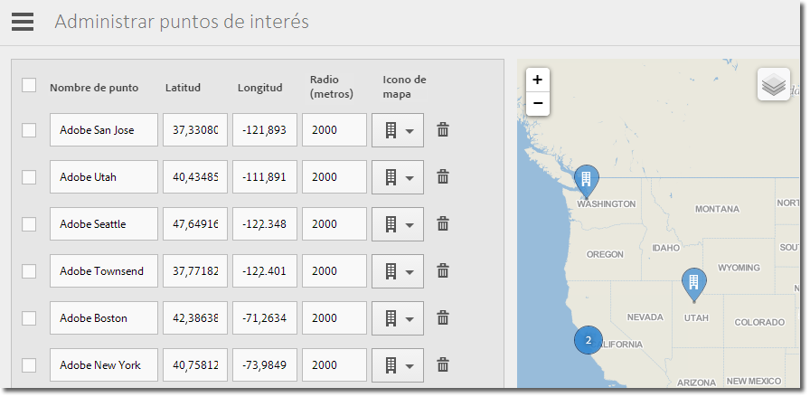

# Administrar puntos de interés {#manage-points-of-interest}

{#eol}

Puede crear y gestionar puntos de interés, los cuales permiten definir ubicaciones geográficas que puede utilizar para fines de correlación o para dirigir los mensajes en la aplicación, entre otras opciones. Cuando se envía una visita en un punto de interés, este se adjunta a la visita.

Antes de utilizar Ubicación, compruebe los siguientes requisitos:

* Debe tener Analytics - Aplicaciones móviles o Analytics Premium.
* Debe activar los **[!UICONTROL informes de ubicación]** en la aplicación.
* Si utiliza una versión del SDK de iOS o de Android anterior a la 4.2, después de agregar **[!UICONTROL puntos de interés]** nuevos, debe descargar un archivo de configuración nuevo y proporcionárselo a los desarrolladores de la aplicación.

   Si utiliza la versión 4.2 u otra posterior del SDK de iOS o del SDK de Android, ya no tendrá que enviar una actualización de la aplicación a la tienda para actualizar los **[!UICONTROL puntos de interés]**. En la página Administrar puntos de interés, al hacer clic en **[!UICONTROL Guardar]**, los cambios se empaquetan en la lista de **[!UICONTROL puntos de interés]** y se actualiza el archivo de configuración de la aplicación activa. La acción de guardar también actualiza la lista de puntos de interés de su aplicación en los dispositivos del usuario, siempre que la aplicación utilice la configuración y el SDK actualizado con una URL de puntos de interés remota.

En el dispositivo del usuario, para que una visita se asigne a un **[!UICONTROL punto de interés]**, se debe activar la ubicación en la aplicación.

Para utilizar Ubicación, haga lo siguiente:

1. Haga clic en el nombre de la aplicación para ir a la página Administrar configuración de aplicación correspondiente.
1. Haga clic en **[!UICONTROL Ubicación]** > **[!UICONTROL Administrar puntos de interés]**.

   

1. Escriba la información en cada uno de los campos siguientes:

   * **[!UICONTROL Nombre de punto]**

      Escriba el nombre del **[!UICONTROL punto de ubicación.]**

      Podría ser el nombre de una ciudad o región. También puede crear un **[!UICONTROL punto de interés]** para ubicaciones específicas, como recintos deportivos o empresas.

   * **[!UICONTROL Latitud]**

      Escriba la latitud del **[!UICONTROL punto de interés]**. Puede buscar esta información en otras fuentes, como Internet.

   * **[!UICONTROL Longitud]**

      Escriba la longitud del **[!UICONTROL punto de interés]**. Puede buscar esta información en otras fuentes, como Internet.

   * **[!UICONTROL Radio (metros)]**

      Especifique el radio (en metros) alrededor del **[!UICONTROL punto de ubicación]** que desea incluir. Por ejemplo, si crea un punto de interés para Denver, Colorado, puede especificar un radio lo suficientemente grande como para incluir la ciudad de Denver y las zonas circundantes, pero excluyendo Colorado Springs.

   * **[!UICONTROL Icono de mapa]**

      Seleccione un icono que se mostrará en los informes [Información general](/help/using/location/c-location-overview.md) y [Mapa](/help/using/location/c-map-points.md).

1. Agregue más puntos de interés según necesite.

   Le recomendamos que no agregue más de 5000 puntos de interés. Si agrega más de 5000 puntos de interés, puede guardarlos, pero recibirá un mensaje de advertencia que le avisará de que lo más recomendable es tener menos de 5000.

1. Haga clic en **[!UICONTROL Guardar]**.

Para eliminar uno o varios puntos de interés, seleccione las casillas de verificación correspondientes y haga clic en **[!UICONTROL Eliminar selección]**.

Haga clic en **[!UICONTROL Importar]** o **[!UICONTROL Exportar]** para trabajar con los datos mediante el uso de un archivo `.csv` en lugar de utilizar la interfaz de usuario de Adobe Mobile.
