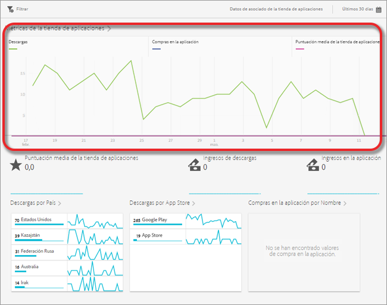
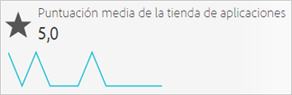
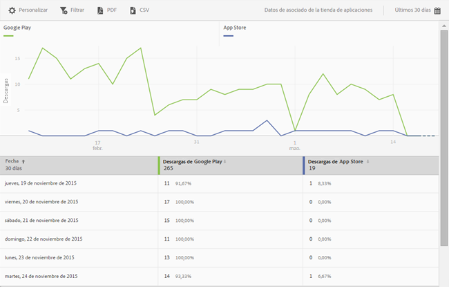
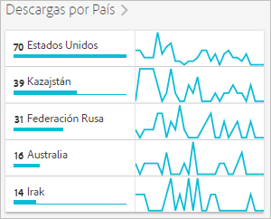
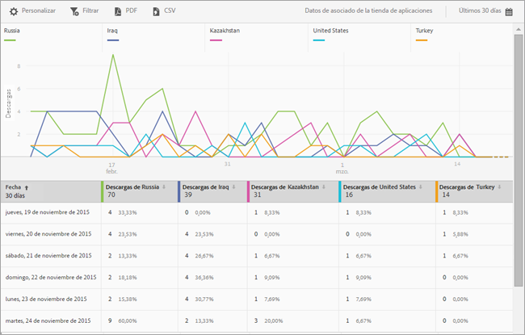
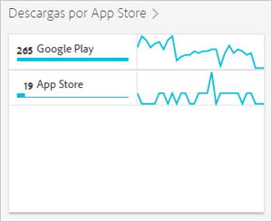

# App Store Overview report{#app-store-overview-report}

El informe **[!UICONTROL Información general de la tienda de aplicaciones]proporciona una instantánea de las métricas de la tienda de aplicaciones, incluido el número de descargas, las compras en la aplicación, la clasificación promedio de la tienda de aplicaciones, los ingresos procedentes de descargas, los ingresos en la aplicación, las descargas por país, las descargas por tienda de aplicaciones y las compras en la aplicación por nombre.**

>[!TIP]
>
>In the Mobile Services UI, the **[!UICONTROL App Store]** menu item and **[!UICONTROL Overview]** report appear in the left navigation menu after you configure the integration.

El informe **[!UICONTROL Información general]contiene un gráfico de evolución a lo largo del tiempo que muestra información sobre el número de descargas desde la tienda de aplicaciones, las compras realizadas dentro de su aplicación y la puntuación media de la misma.**

Puede hacer clic en cualquier métrica para ocultar o mostrar su línea correspondiente. Para ver los datos de un día, coloque el ratón encima de él.

>[!IMPORTANT]
>
>Las métricas de almacén de aplicaciones, como descargas, clasificación, ingresos, clasificación, etc. en Adobe Analytics requieren una integración de Conector de datos con un proveedor apropiado. `appFigures` proporciona actualmente una integración que requiere la compra del producto o servicio apropiado de `appFigures`**antes** de que pueda habilitar la integración. Para obtener más información sobre las integraciones de Data Connector, consulte [Adobe Exchange](https://www.adobeexchange.com/experiencecloud.html).

>[!TIP]
>
>Además de cambiar el intervalo de fechas del informe haciendo clic en el icono del calendario en la parte superior derecha, puede personalizar algunos de los informes detallados, agregar filtros y series (métricas), agregar filtros adhesivos y descargar el informe en formato PDF o CSV. For more information, see [Customize reports](/help/using/usage/reports-customize/reports-customize.md).

## Puntuación media de la tienda de aplicaciones {#section_60D0D21824AE4450BC3E34D7ACA12A7A}

Este informe muestra la puntuación media que los usuarios han dado a su aplicación mediante la funcionalidad de la tienda de aplicaciones.

You can click anywhere on the **[!UICONTROL App Store Average Rating]** widget to display a graph and chart that displays the average rating by date. Para ver los datos de un día, coloque el ratón encima de él.

## Ingresos de descargas {#section_34F05998E8444544A1B507C1B852C4EE}

Este informe muestra la cantidad de ingresos que generan las descargas de su aplicación.

## Ingresos en la aplicación {#section_58792ED9C4B54B7D836E30CF09E8E204}

Este informe muestra la cantidad de ingresos procedentes de las ventas en la aplicación que se realizaron con su aplicación.

## Descargas por País {#section_10373CD28CA94BA5859DFDEED7D548C6}

Este informe muestra el número de descargas de su aplicación agrupadas por país.

Para mostrar un gráfico con el número de descargas por país y fecha, haga clic en **[!UICONTROL Descargas por País]**. Puede colocar el ratón encima de una fecha para ver los datos de un día.

## Descargas por App Store {#section_F1CD1A3F0105469D879E4F280CE32484}

Este informe muestra el número de descargas de su aplicación agrupadas por tienda de aplicaciones.

Para mostrar un gráfico con el número de descargas por tienda de aplicaciones y fecha, haga clic en **[!UICONTROL Descargas por App Store]**. Puede colocar el ratón encima de una fecha para ver los datos de ese día.

## Compras en la aplicación por Nombre {#section_D747A64F9F6449E0A02EF31D56C92F83}

Este informe muestra todas las compras en la aplicación por nombre.
