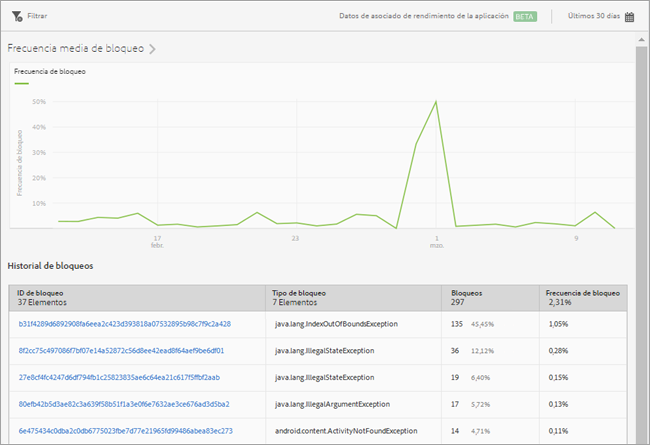

# Informe Bloqueos {#crashes}

El informe **[!UICONTROL Bloqueos]ofrece una instantánea de los bloqueos de la aplicación.** Puede ver el número de bloqueos y la frecuencia de bloqueo, así como iniciar sesión en la interfaz de usuario de Apteligent.

>[!IMPORTANT]
>
>To display the **[!UICONTROL Crashes]** report in the left navigation, you must first integrate your app with Apteligent.

The **[!UICONTROL Average Crash Rate]** graph displays the crash rate by date. Puede pasar el ratón sobre cualquier fecha para ver la frecuencia de bloqueo de ese día.

The **[!UICONTROL Crash History]** chart displays information about each app crash, including the crash ID, crash type, number or crashes, and the crash date. Para iniciar sesión en Apteligent y ver más detalles sobre un bloqueo, haga clic en el vínculo en la columna **[!UICONTROL ID de bloqueo].**

Para este informe, puede configurar las siguientes opciones:

* **[!UICONTROL Período de tiempo]**

   Haga clic en el icono de **[!UICONTROL calendario]para seleccionar un período de tiempo personalizado o elegir un período de tiempo preestablecido en la lista desplegable.**

* **[!UICONTROL Filtro]**

   Haga clic en **[!UICONTROL Filtro]para crear un filtro que incluya distintos informes con el fin de ver el comportamiento de un segmento en todos los informes móviles.** Un filtro adhesivo permite definir un filtro que se aplica a todos los informes sin rutas.

   Para obtener más información, consulte [Agregue un filtro adhesivo](/help/using/usage/reports-customize/t-sticky-filter.md).