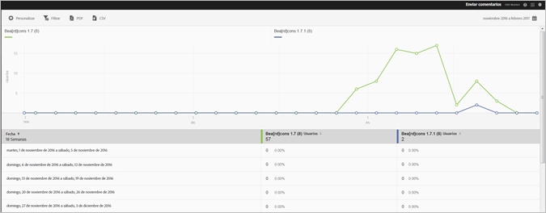

# Informe de versiones {#versions}

El informe de versiones es un informe de horas extras que muestra información sobre las distintas versiones de la aplicación que se ejecutan en el dispositivo de un usuario.

A continuación, puede ver un ejemplo de este informe:

