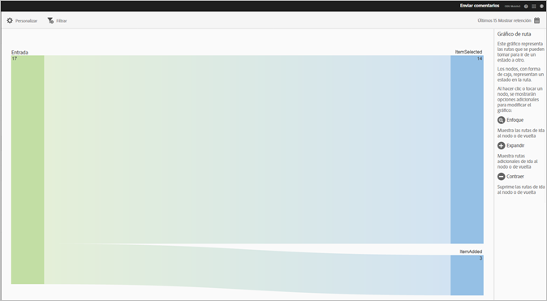
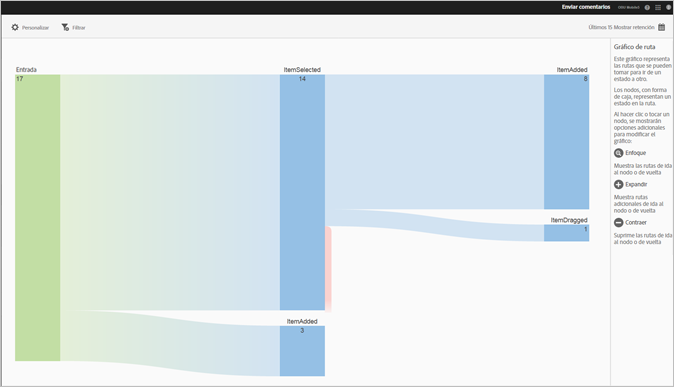
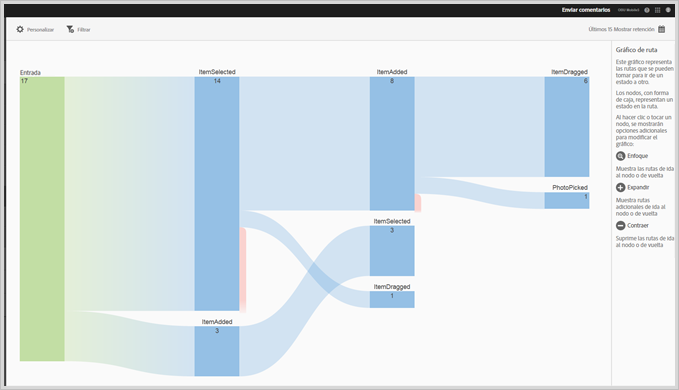
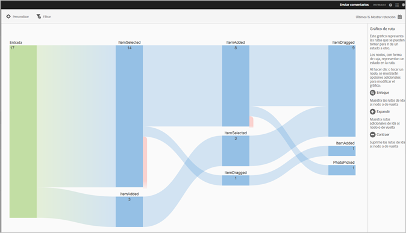

# Informe de rutas de acción{#action-paths}

El informe Rutas de acción se basa en el análisis de las rutas y muestra un gráfico que representa las rutas que han pasado de un estado a otro en la aplicación.

Los informes **[!UICONTROL Ver rutas]** y **[!UICONTROL Rutas de acción]** son informes de rutas. El informe **[!UICONTROL Ver rutas]** permite ver cómo navegan los usuarios en la aplicación de una pantalla a otra. El informe **[!UICONTROL Ver acciones]** muestra la secuencia de acciones y eventos, como clics, selecciones, cambios de tamaño, etc., que los usuarios realizan en la aplicación.

>[!TIP]
>
>Puede utilizar un informe de embudo para combinar la navegación y las acciones en un informe. Para obtener más información, consulte [Embudo](/help/using/usage/reports-funnel.md).

Cada nodo, que es similar a una caja, representa un estado en las rutas de los usuarios a través de una aplicación. Por ejemplo, en el gráfico anterior, el nodo principal representa el número de usuarios que iniciaron la aplicación y luego seleccionaron una fotografía de la galería.

Si desea ver las opciones para modificar el gráfico, haga clic en un nodo y luego en **[!UICONTROL Enfocar]** o **[!UICONTROL Expandir]**. Por ejemplo, si hace clic en el estado **[!UICONTROL PhotoPicked]** del nodo principal, aparecen los iconos **[!UICONTROL Enfocar]** y **[!UICONTROL Expandir]**.

Para expandir, haga clic en el icono **[!UICONTROL +]**. Esta opción muestra las rutas adicionales que entran o salen del nodo. En el gráfico de abajo, el estado 1 inicia la aplicación, el estado 2 elige una foto (el elemento que expandió anteriormente) y el estado 3 incluye las diferentes rutas que tomaron los usuarios:

* Seleccionar un elemento
* Añadir un elemento
* Arrastrar un elemento
* Escalar un elemento

La expansión de un estado es similar a un canal.

Para aislar el nodo y mostrar las rutas que llegan al nodo seleccionado y salen de él, haga clic en el icono . En el gráfico a continuación, las siguientes rutas se completaron **antes** de que los usuarios seleccionaran una fotografía:

* Rotar un elemento
* Escalar un elemento
* Arrastrar un elemento
* Eliminar un elemento

De los usuarios que seleccionaron una foto, las siguientes rutas se completaron **después** de seleccionarla:

* Seleccionar un elemento
* Añadir un elemento
* Arrastrar un elemento
* Escalar un elemento

Puede enfocar o expandir varios nodos para obtener una vista detallada de las rutas que toman los usuarios en la aplicación. Por ejemplo:

Para este informe, puede configurar las siguientes opciones:

* **[!UICONTROL Periodo]**

   Haga clic en el icono de **[!UICONTROL calendario]** para seleccionar un periodo personalizado o elegir un periodo preestablecido en la lista desplegable.

* **[!UICONTROL Personalizar]**

   Personalice los informes cambiando las opciones **[!UICONTROL Mostrar por]**, agregando métricas, filtros, series (métricas) adicionales y mucho más. Para obtener más información, consulte [Personalización de informes](/help/using/usage/reports-customize/reports-customize.md).

* **[!UICONTROL Filtro]**

   Haga clic en **[!UICONTROL Filtro]** para crear un filtro que incluya distintos informes con el fin de ver el comportamiento de un segmento en todos los informes móviles. Un filtro adhesivo permite definir un filtro que se aplica a todos los informes sin rutas. Para obtener más información, consulte [Añadir un filtro adhesivo](/help/using/usage/reports-customize/t-sticky-filter.md).

* **[!UICONTROL Descargar]**

   Haga clic en **[!UICONTROL PDF]** o **[!UICONTROL CSV]** para descargar o abrir documentos, compartirlos con otros usuarios que no tengan acceso a Mobile Services o usarlos en presentaciones.
