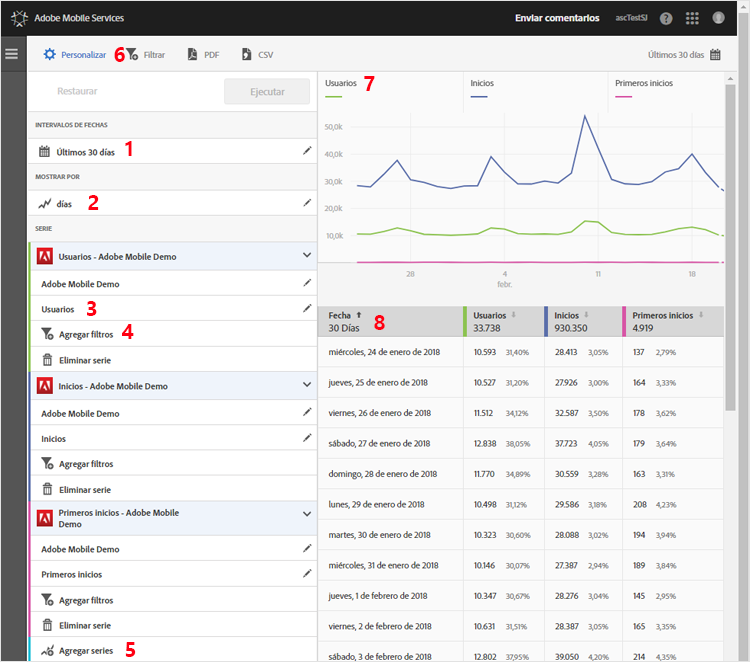

# Personalización de informes {#customize-reports}

{#eol}

Esta información sirve para comprender y personalizar los informes integrados.

Puede personalizar los informes cambiando el intervalo de fechas y las opciones de **[!UICONTROL Mostrar por]** (vea gráficos y datos de tablas por períodos de tiempo o dimensiones), agregar métricas, filtros y series (métricas) adicionales, etc.

Para mostrar el carril Personalizar, haga clic en el nombre de la aplicación para ir a la página Información general correspondiente y, a continuación, haga clic en **[!UICONTROL Personalizar]**.

En el siguiente ejemplo se muestra el informe Usuarios y sesiones con el carril **[!UICONTROL Personalizar]** abierto. Este ejemplo muestra, por días, los datos de los últimos 30 días y tiene cuatro series activas:

* **[!UICONTROL Usuarios]**
* **[!UICONTROL Inicios]**
* **[!UICONTROL Primeros lanzamientos]**
* **[!UICONTROL Descargas de App Store]**

La siguiente información describe las áreas del informe y el carril **[!UICONTROL Personalizar]**:

| Número | Descripción |
|--- |--- |
| 1 | En **[!UICONTROL Intervalos de fechas]**, la lista desplegable permite seleccionar varios intervalos de fechas para el informe. Los datos del gráfico (9) y la tabla correspondiente (10) respetan el intervalo de fechas seleccionado. |
| 2 | En **[!UICONTROL Mostrar por]**, la lista desplegable permite seleccionar una visualización basada en el tiempo o en dimensiones para el informe.  Por ejemplo, en la ilustración, se ve que Días está seleccionado. Si observa las fechas que aparecen debajo del gráfico (7) y las filas de la tabla (8), los datos se clasifican por fecha en un informe de horas extras. Se pueden incluir seis métricas como máximo en estos tipos de informes mediante la adición de series adicionales al informe.  Si selecciona una dimensión de ciclo vital, puede ver los 50 valores principales en una lista clasificada, los 5 valores principales de tendencias por día o semana, o un desglose de los 5 o 10 valores principales. |
| 3 | **[!UICONTROL Serie]** representa métricas individuales, como Usuarios, Inicios, Primeros lanzamientos y Descargas de App Store en el ejemplo anterior. Cada serie tiene un color según los datos que aparecen en el gráfico (7) y la tabla (8).  Puede agregar series (métricas) adicionales e incluso diferentes aplicaciones en distintos grupos de informes para comparar los datos.  Para obtener más información, consulte [Agregar series (métricas) a informes](/help/using/usage/reports-customize/t-reports-series.md). |
| 4 | Con **[!UICONTROL Añadir filtro]**, puede personalizar los informes integrados añadiendo filtros (segmentos) adicionales.  Para obtener más información, consulte [Agregar filtros a informes](/help/using/usage/reports-customize/t-reports-customize.md). |
| 5 | Con **[!UICONTROL Agregar serie]**, puede personalizar los informes integrados mediante la adición de series (métricas) adicionales o aplicaciones en diferentes grupos de informes para comparar datos.  Para obtener más información, consulte [Agregar series (métricas) a informes](/help/using/usage/reports-customize/t-reports-series.md). |
| 6 | Con **[!UICONTROL Filtro adhesivo]**, puede crear un filtro que abarque distintos informes. Tal vez le interese ver el rendimiento de un segmento concreto en todos los informes móviles. Un filtro adhesivo le permite definir un filtro que se aplica a todos los informes sin rutas.  Para obtener más información, consulte [Agregar filtro adhesivo](/help/using/usage/reports-customize/t-sticky-filter.md). |
| 7 | El **[!UICONTROL Gráfico de datos]** muestra los datos en un gráfico correspondiente en función de las métricas seleccionadas. Los tipos de gráficos incluyen gráficos de líneas, gráficos de barras, gráficos circulares, etc. |
| 8 | La **[!UICONTROL Tabla de datos]** muestra los datos en forma de tabla. Puede hacer clic en un encabezado de columna para ordenar los datos de forma ascendente o descendente. |
