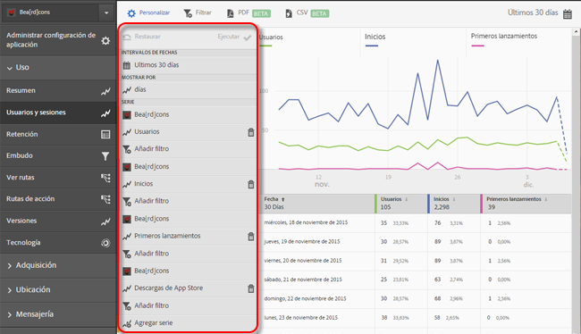

# Add filters to reports{#add-filters-to-reports}

Esta información sirve para personalizar los informes integrados mediante la adición de filtros (segmentos) adicionales.

>[!IMPORTANT]
>
>Las métricas de aplicaciones móviles también están disponibles en informes y análisis de marketing, análisis específicos, almacén de datos y otras interfaces de informes de Analytics. Si un tipo de informe o desglose no está disponible en Adobe Mobile, se puede generar usando otra interfaz de generación de informes.

En este ejemplo, personalizaremos el informe **[!UICONTROL Usuarios y sesiones], pero las instrucciones sirven para cualquier informe.**

1. Abra la aplicación y haga clic en **Uso** &gt; **[!UICONTROL Usuarios y sesiones]**.

   

   En este informe se proporciona una vista de tiempo extra completa de nuestros usuarios de la aplicación. Sin embargo, las métricas para las dos versiones de iOS y Android de esta aplicación se recopilan en el mismo grupo de informes. Podemos segmentar a los usuarios por sistema operativo móvil agregando un filtro personalizado a la métrica Usuarios.

1. Click **[!UICONTROL Customize]**.

   

1. Under **[!UICONTROL Users]**, click **[!UICONTROL Add Filter]** and click **[!UICONTROL Add Rule]**.

1. Select **[!UICONTROL Operating Systems]**, and from the drop-down list, and select **[!UICONTROL iOS]**.

   

   To add Android as a filter, you need to repeat this step.

1. Click **[!UICONTROL And]**, select **[!UICONTROL Operating Systems]** from the drop-down list, and select **[!UICONTROL Android]**.

   Los filtros deberían tener un aspecto similar al siguiente ejemplo:

   

1. Haga clic en **[!UICONTROL Actualizar]**.
1. To regenerate the report, click **[!UICONTROL Run]**.

   Ahora, este informe muestra los usuarios desglosados por sistema operativo. El título del informe se ha modificado para que coincida con los filtros que se le han aplicado.

   

   You can customize this report more. From iOS 8.3, you can add the First Launches metric with an iOS 8.3 operating system version filter to see how many iOS 8.3 customers upgraded their apps and performed a first launch.
1. Under **[!UICONTROL First Launches]**, click **[!UICONTROL Add Filter]**, click **[!UICONTROL Add Rule]**, select **[!UICONTROL Operating Systems]** from the drop-down list, and select **[!UICONTROL iOS]**.
1. Click **[!UICONTROL And]**, select **[!UICONTROL Operating System Versions]** from the drop-down list, and select **[!UICONTROL iOS 8.3]**.

   Los filtros deberían estar como en este ejemplo:

   

1. Click **[!UICONTROL Update]** and **[!UICONTROL Run]**.

   Ahora, en este informe se muestran los usuarios con iOS 8.3 que han utilizado la aplicación por primera vez.

   

   Pruebe las diferentes opciones del menú de personalización del informe y no olvide agregar sus favoritos. Report URLs in Adobe Mobile are functional and can be emailed or added to your favorites.
