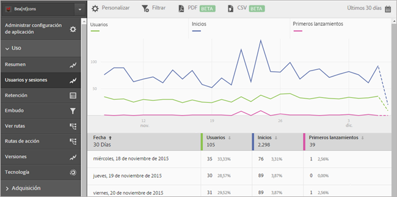

# Agregar series (métricas) a informes {#add-series-metrics-to-reports}

Esta información sirve para personalizar los informes integrados mediante la adición de series (métricas) adicionales o aplicaciones en distintos grupos de informes para comparar los datos.

>[!IMPORTANT]
>
>Las métricas de aplicación de móvil también están disponibles en los informes y análisis de marketing, los análisis específicos, el almacén de datos y otras interfaces de generación de informes de Analytics. Si un tipo de informe o desglose no está disponible en Adobe Mobile, se puede generar usando otra interfaz de generación de informes.

En este ejemplo, personalizaremos el informe **[!UICONTROL Usuarios y sesiones]**, pero las instrucciones se pueden aplicar para cualquier informe.

1. Abra la aplicación y haga clic en **[!UICONTROL Uso]** > **[!UICONTROL Usuarios y sesiones]**.

   

   Este informe proporciona una vista completa de las horas extra de los usuarios de la aplicación. Sin embargo, queremos agregar una serie para informar sobre bloqueos de aplicaciones.

1. Haga clic en **[!UICONTROL Personalizar]**.

   

1. Desplácese hacia abajo y haga clic en **[!UICONTROL Agregar serie]**.

   El nombre de la serie se rellena con el mismo nombre que la última serie de la lista. En la ilustración anterior, la última serie es **[!UICONTROL Descargas de App Store]**, de modo que se agrega una serie nueva que también se llama **[!UICONTROL Descargas de App Store]**.

1. Complete una de las siguientes tareas:

   * Para agregar una serie (métrica) nueva, haga clic en el nombre de la que acaba de crear y seleccione una nueva métrica de ciclo de vida en la lista desplegable.

      

   * Si quiere agregar una aplicación nueva en un grupo de informes diferente para poder comparar los datos de distintas aplicaciones, haga clic en el nombre de la aplicación en la serie recién creada y seleccione la aplicación que desee.

      

1. (Condicional) Agregue filtros a la serie nueva.

   Para obtener más información, consulte [Adición de filtros a informes](/help/using/usage/reports-customize/t-reports-customize.md).
1. Haga clic en **[!UICONTROL Actualizar]** y **[!UICONTROL Ejecutar]**.
