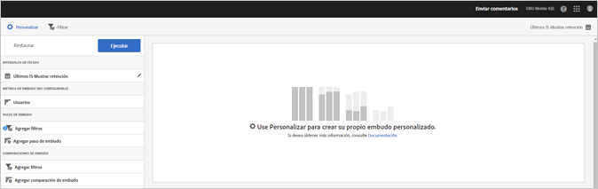

# Informe Embudo {#funnel}

El informe **[!UICONTROL Embudo]** identifica el punto en el que los clientes abandonaron una campaña de marketing o se desviaron de una ruta de conversión definida al interactuar con la aplicación móvil. Asimismo, puede utilizar el informe **[!UICONTROL Embudo]** para comparar las acciones de diferentes segmentos.

El aumento de la visibilidad de las decisiones de los clientes en cada paso le permite ver en qué momento pierden el interés, la ruta que suelen seguir y el momento en el que abandonan la aplicación.

Al abrir el informe **[!UICONTROL Embudo]**, debe crear un canal personalizado. Para obtener más información, consulte [Personalización de informes](/help/using/usage/reports-customize/reports-customize.md).

>[!TIP]
>
>Para guardar el embudo personalizado, guarde la URL después de configurar los valores y ejecutar el informe. Puede compartir la dirección URL o guardarla en un documento.

A continuación, puede ver un ejemplo de este informe:

Para mostrar un canal simple, aquí están los ajustes de una configuración que utiliza tres pasos de canal y dos comparaciones de canal. Suponemos que una aplicación de demostración permite a los usuarios agregar un elemento, como una fotografía, y luego compartirlo.

En la ventana Personalizar, hay secciones que indican que el usuario ha iniciado la aplicación, ha añadido una fotografía de una galería en la aplicación, ha compartido una o varias fotos de la aplicación en medios sociales, ha enviado un mensaje de texto, ha enviado un correo electrónico, etc. Las comparaciones de canal le permiten comparar los niveles de adición y uso compartido de fotografías entre los usuarios de la aplicación de iOS y de Android.

Para generar el informe, haga clic en **[!UICONTROL Ejecutar]**.

A continuación, puede ver un ejemplo de un informe generado:

La primera serie muestra que el 100% de los usuarios iniciaron la aplicación. La segunda serie muestra que un porcentaje mayor de usuarios de Android agregó una foto desde la galería. La tercera serie muestra que casi la mitad de los usuarios de iOS compartieron la foto, pero ninguno de los usuarios de Android la compartió. Esto podría indicar un problema con la aplicación que debe investigarse.

Para mostrar información adicional, pase el ratón sobre cualquier barra del gráfico.

Para este informe, puede configurar las siguientes opciones:

* **[!UICONTROL Periodo]**

   Haga clic en el icono de **[!UICONTROL calendario]** para seleccionar un periodo personalizado o elegir un periodo preestablecido en la lista desplegable.
* **[!UICONTROL Personalizar]**

   Personalice los informes cambiando las opciones **[!UICONTROL Mostrar por]**, agregando métricas, filtros, series (métricas) adicionales y mucho más. Para obtener más información, consulte [Personalización de informes](/help/using/usage/reports-customize/reports-customize.md).
* **[!UICONTROL Filtro]**

   Haga clic en **[!UICONTROL Filtro]** para crear un filtro que incluya distintos informes con el fin de ver el comportamiento de un segmento en todos los informes móviles. Un filtro adhesivo permite definir un filtro que se aplica a todos los informes sin rutas. Para obtener más información, consulte [Agregar filtro adhesivo](/help/using/usage/reports-customize/t-sticky-filter.md).
* **[!UICONTROL Descargar]**

   Haga clic en **[!UICONTROL PDF]** o **[!UICONTROL CSV]** para descargar o abrir documentos, compartirlos con otros usuarios que no tengan acceso a Mobile Services o usarlos en presentaciones.