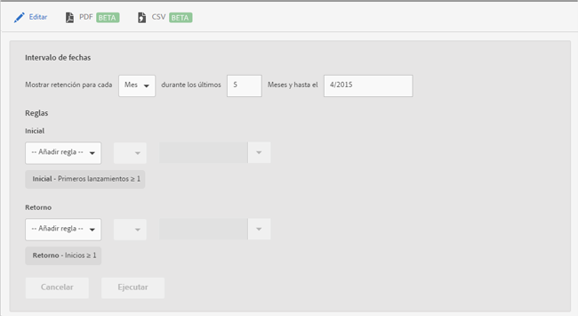

# Retention report {#retention}

El informe **[!UICONTROL Retención](anteriormente, cohorte de primer inicio) es un informe de cohorte que muestra cuántos usuarios únicos iniciaron la aplicación por primera vez y luego la volvieron a iniciar al menos una vez durante los meses siguientes.**

De forma predeterminada, este informe muestra la retención de grupos de usuarios en función del momento en el que iniciaron la aplicación por primera vez. Puede personalizar este informe para utilizar otras métricas además del primer inicio, así como agregar acciones adicionales.

Una cohorte es un grupo de personas que comparten una característica o experiencia común durante un período definido. El informe **[!UICONTROL Retención]toma la característica común de usuarios que han instalado la aplicación un día, una semana o un mes concretos y luego genera un gráfico de cuántos de esos usuarios han iniciado la aplicación durante los X días, semanas o meses siguientes.** El informe muestra la eficacia de retención de los visitantes como activos o participativos.

A continuación, puede ver un ejemplo de este informe:

En la columna **[!UICONTROL M0], se indica el número total de personas que iniciaron la aplicación por primera vez en noviembre de 2014.** En la columna **[!UICONTROL M1], se indica el número de personas que iniciaron la aplicación nuevamente en diciembre de 2014 y así sucesivamente.**

Para cambiar el intervalo de fechas o modificar las reglas del informe, haga clic en **[!UICONTROL Editar]**.

El informe se puede rellenar con cualquier variable o métrica, como las métricas del ciclo vital, pero no con métricas calculadas.
