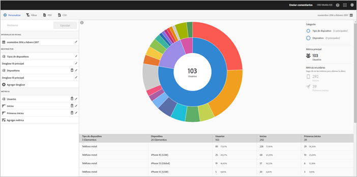

# Informe Tecnología {#technology}

El informe **[!UICONTROL Tecnología]sirve para ver los diferentes tipos de dispositivos, sistemas operativos, versiones de sistemas operativos y operadores de telefonía móvil en los que se utiliza la aplicación.**

Este informe ofrece una visualización de destello solar de los datos existentes. Lo puede usar para descubrir segmentos de audiencias (conjuntos de visitantes) a los que desee dirigirse. Crear y administrar audiencias es similar a crear y usar segmentos, con la diferencia de que las audiencias se pueden publicar en Experience Cloud.

## Navegación y uso {#section_83CA60E1AE6245FEBCBFF3205615C4DF}

Esta visualización ofrece, por ejemplo, el informe básico y los desgloses, usa la altura para mostrar la métrica resaltada y señala las diferencias de rendimiento entre las métricas. Cada anillo representa un segmento de audiencia en la categoría del anillo. Puede realizar acciones en una audiencia, como aplicar un filtro adhesivo y ocultar o ver métricas.

>[!TIP]
>
>Además de esta información, puede ver un tutorial en el producto que describe cómo interactuar con el gráfico radial. To start the tutorial, click **[!UICONTROL Technology Breakdown]** in the title bar of the report, click **[!UICONTROL Customize]**, and click the **[!UICONTROL i]** icon.

En el informe de destello solar, interactivo, se pueden realizar las tareas siguientes:

* Sitúe el ratón encima de cualquier parte del gráfico para ver más información.
* Para cambiar el período de tiempo, haga clic en el icono del **[!UICONTROL calendario].**
* Haga clic en un trozo del anillo para seleccionar la audiencia en la que puede realizar acciones, como ampliar, ocultar audiencias y crear un mensaje en la aplicación o un filtro adhesivo.
* En la esquina superior derecha, seleccione **[!UICONTROL Tipo de dispositivo]** y **Dispositivo]para ver información sobre los dispositivos y tipos de dispositivos.[!UICONTROL **

* Haga clic en una métrica secundaria de la derecha para agregarla a la visualización.

   Puede mostrar la métrica secundaria mediante el uso del color, la altura o ambos valores.

En la siguiente tabla se describen los informes estándar y cómo se rellenan en Mobile Services:

| Informe | Método de obtención de datos | Descripción |
|--- |--- |--- |
| Device   | Métricas del ciclo vital | Métricas comunes desglosadas por tipo de dispositivo. |
| Sistema operativo | Automático | Métricas comunes desglosadas por sistema operativo. |
| Versión del sistema operativo | Métricas del ciclo vital | Métricas comunes desglosadas por versión de sistema operativo. |
| Operadores de telefonía móvil | Automático | Métricas comunes desglosadas por operadores de telefonía móvil. |

>[!TIP]
>
>En el informe **[!UICONTROL Portadoras]** , se informa a los usuarios de Wi-Fi como `none`.

## Agregar desgloses y métricas {#section_15833511E82648869E7B1EFC24EF7B82}

Puede agregar desgloses y métricas secundarias, que modifican la altura de cada audiencia en relación con otras audiencias del gráfico.

>[!IMPORTANT]
>
>Cuantos más anillos agregue al destello solar, más tardará en procesarse.

Para agregar desgloses y métricas secundarias, haga clic en **[!UICONTROL Desglose de tecnología]** en la barra de título del informe y luego haga clic en **[!UICONTROL Personalizar]**.

When you click **[!UICONTROL Add Breakdown]** or **[!UICONTROL Add Metric]**, a new item displays with the same name as the previous item in the list. Haga clic en el desglose o la métrica que acaba de crear para acceder a una lista desplegable desde la que podrá seleccionar un elemento nuevo.

## Crear un filtro adhesivo {#section_B4E355CD1FE34E4C8ADC38139ED67FC8}

Haga clic en un trozo del anillo a fin de seleccionar la audiencia para la que desea crear un filtro adhesivo y, a continuación, haga clic en **[!UICONTROL Filtro adhesivo]**. Este filtro permite aplicar los filtros actuales y ejecutar un informe nuevo basado en los filtros.

## Uso compartido de informes {#section_560DD5CED5144249B7E49461E2422100}

Después de crear un informe, se usa su configuración para crear una dirección URL personalizada, que puede copiar y compartir.
