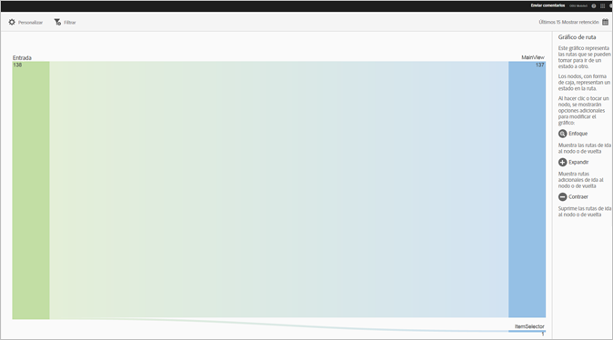
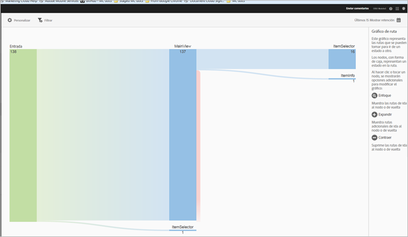
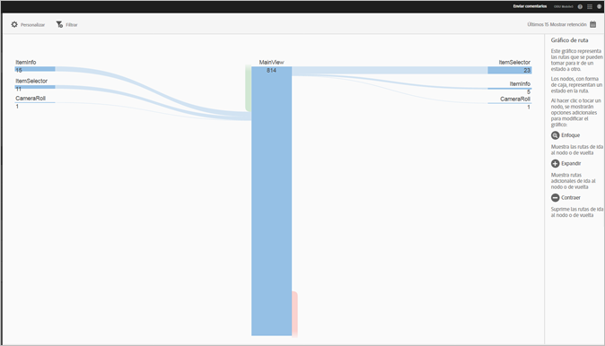
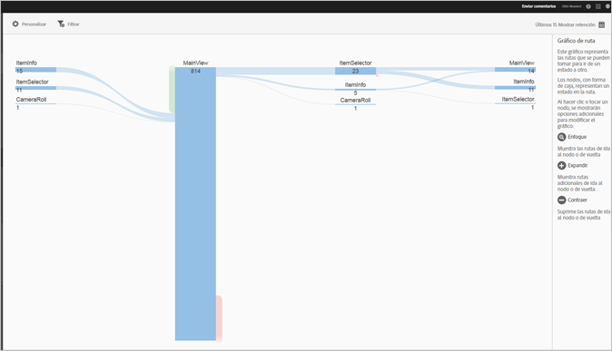

# View Paths report {#view-paths}

El informe **[!UICONTROL Ver rutas], que se basa en el análisis de estas, muestra un gráfico que representa las rutas que pasaron de un estado a otro en la aplicación.**

>[!TIP]
>
>The **[!UICONTROL View Paths]** and **[!UICONTROL View Action]** reports are similar because both are pathing reports. El informe **[!UICONTROL Ver rutas]permite ver cómo navegan los usuarios en la aplicación de una pantalla a otra.** El informe **[!UICONTROL Ver acciones]muestra la secuencia de acciones y eventos, como clics, selecciones, cambios de tamaño, etc., que los usuarios realizan en la aplicación.** You can use a funnel report to combine navigation and actions in one report. For more information, see [Funnel](/help/using/usage/reports-funnel.md).

Cada nodo, que es similar a una caja, representa un estado en las rutas de los usuarios a través de una aplicación. Por ejemplo, en la ilustración anterior, el nodo principal representa el número de usuarios que han iniciado la aplicación y han navegado a la vista principal.

Cuando haga clic en un nodo para proporcionar las opciones adicionales que permiten modificar el gráfico, aparecerán iconos como **[!UICONTROL Enfocar]** o **Expandir[!UICONTROL .]** Por ejemplo, si hace clic en el estado **[!UICONTROL MainView]** del nodo principal, aparecen los iconos **[!UICONTROL Enfoque]y** Expandir **.**

To expand the view, click the **[!UICONTROL +]** icon to display the additional paths that come in to or go from the node. En la ilustración siguiente, el estado 1 inicia la aplicación, el estado 2 está viendo la página principal de la aplicación y el estado 3 incluye las siguientes rutas que tomaron los usuarios:

* Navegar al carrete
* Navegar al selector de elementos
* Navegar a la cámara
* Navegar a la página de información del elemento

Click  to isolate the node and to show the paths that are coming into and going out of the selected node. En la ilustración de abajo, las rutas siguientes anteceden a los usuarios que estaban viendo la vista principal de la aplicación:

* Información del elemento
* Selector de elementos
* Carrete
* Cámara

Puede enfocar o expandir varios nodos para obtener una vista detallada de las rutas que siguen los usuarios en la aplicación. Por ejemplo:

Para este informe, puede configurar las siguientes opciones:

* **[!UICONTROL Período]** de tiempo Haga clic en el icono **[!UICONTROL Calendario]** para seleccionar un período personalizado o para seleccionar un período de tiempo preestablecido en la lista desplegable.
* **[!UICONTROL Personalice]** los informes cambiando las opciones de **[!UICONTROL Mostrar por]** , agregando métricas y filtros y agregando series (métricas) adicionales, entre otras cosas. For more information, see [Customize Reports](/help/using/usage/reports-customize/reports-customize.md).
* **[!UICONTROL Filter
Click Filter to create a filter that spans different reports to see how a segment is performing across all mobile reports.]****** Un filtro adhesivo permite definir un filtro que se aplica a todos los informes sin rutas. Para obtener más información, consulte [Agregar filtro](/help/using/usage/reports-customize/t-sticky-filter.md)adhesivo.
* **[!UICONTROL Download]**
Click **[!UICONTROL PDF]** or **[!UICONTROL CSV]** to download or open documents and share with users who do not have access to Mobile Services or to use the file in presentations.