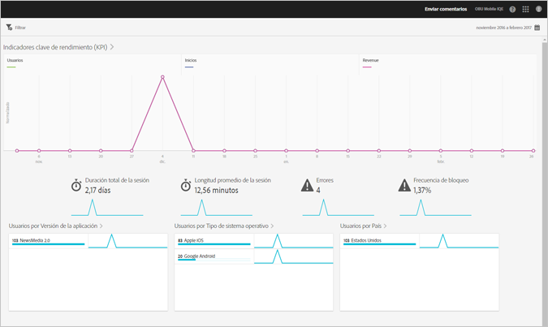

# Informe de información general {#overview}

El informe Información general proporciona una instantánea de las métricas clave.

A continuación, puede ver un ejemplo de este informe:

Puede cambiar el intervalo de fechas del informe haciendo clic en el icono del calendario en la parte superior derecha. También puede crear un filtro adhesivo que incluya distintos informes con el fin de ver el comportamiento de un segmento en todos los informes móviles. Para obtener más información sobre la creación de un filtro adhesivo, consulte [Agregar un filtro adhesivo](/help/using/usage/reports-customize/t-sticky-filter.md).

>[!TIP]
>
>Las métricas clave de este informe se configuran al crear la aplicación. Para obtener más información, consulte [Configuración de la aplicación](/help/using/c-manage-app-settings/c-mob-confg-app/c-mob-confg-app.md).
