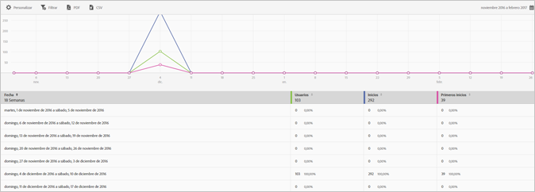

# Users and sessions report{#users-and-sessions}

El informe Usuarios y sesiones muestra las métricas de visitantes únicos durante el lapso de tiempo seleccionado.

Para este informe, puede configurar las siguientes opciones:

* **[!UICONTROL Período de tiempo]**

   Haga clic en el icono de **[!UICONTROL calendario]para seleccionar un período de tiempo personalizado o elegir un período de tiempo preestablecido en la lista desplegable.**

* **[!UICONTROL Personalizar]**

   Customize your reports by changing the **[!UICONTROL Show By]** options, adding metrics and filters, and adding additional series (metrics), and more. For more information, see [Customize Reports](/help/using/usage/reports-customize/t-reports-customize.md).

* **[!UICONTROL Filtro]**

   Haga clic en **[!UICONTROL Filtro]para crear un filtro que incluya distintos informes con el fin de ver el comportamiento de un segmento en todos los informes móviles.** Un filtro adhesivo permite definir un filtro que se aplica a todos los informes sin rutas. For more information, see Add sticky filter.

* **[!UICONTROL Descargar]**

   Click **[!UICONTROL PDF]** or **[!UICONTROL CSV]** to download or open documents and share with users who do not have access to Mobile Services or to use the file in presentations.