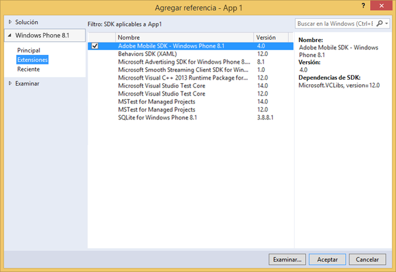

# Extensiones de Windows Visual Studio para soluciones de SDK de Experience Cloud 4.x {#windows-visual-studio-extensions-for-experience-cloud-solutions-x-sdk}

Estas extensiones le proporcionan una forma mucho más sencilla de agregar la referencia del SDK para Windows de soluciones de Experience Cloud 4.x en su proyecto.

## Instalación de la biblioteca desde GitHub {#section_F55DB6241EF1475286C05FEAEBF996A3}

1. Descargue el SDK universal de Windows desde [GitHub](https://github.com/Adobe-Marketing-Cloud/mobile-services/releases).
1. Descomprima el archivo descargado localmente.
1. Haga doble clic en el archivo ADBMobileWindowsStoreVSIX.vsix o ADBMobileWindowsPhoneVSIX.vsix para abrir el instalador.

1. Seleccione **[!UICONTROL Ubicación global]** e instale la biblioteca.

## Agregar referencias al proyecto {#section_00C14FE9243D4330BE1F4BB56FCF08B1}

1. Abra el proyecto de Windows 8.1 o Windows Phone 8.1.
1. Abra el cuadro de diálogo Administrador de referencias.

   

1. En la pestaña **[!UICONTROL Extensions]** de Windows 8.1 o Windows Phone 8.1, busque y seleccione **[!UICONTROL Adobe Mobile SDK]**.
1. Haga clic en **[!UICONTROL OK]** para guardarlo.

   El SDK de Adobe Mobile se agregará al proyecto y, si aún no se ha agregado, también se añadirá el paquete **[!UICONTROL Microsoft Visual C++ Runtime]**.

1. En el Administrador de configuración, seleccione un tipo de plataforma y comience a probar la aplicación.
